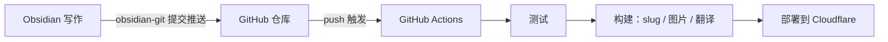

---
title: 使用GitHub Actions 实现博客自动化更新
createdAt: 2026-08-13
published: true
updatedAt: 2026-08-13
description: 在 Obsidian 里写完文章，按一次提交。测试、slug 生成、图片处理、多语言翻译和部署，剩下的全部自动完成。
tags:
  - 自动化
  - obsidian
  - actions
slug: 20260813-01
---
我发布一篇文章的全部操作是：在 Obsidian 里写完，点一次提交。几分钟后文章出现在网站上，带着自动生成的 URL、响应式图片和英文、日文、繁体三个翻译版本。中间没有任何手动步骤，我甚至不需要打开终端。

这套流程搭起来不复杂，这篇文章讲清楚它的原理和配置。

## 原理

核心只有一个决定：把 Obsidian 的库直接开在博客仓库的内容目录里。我的仓库里 `src/content/` 就是 vault 本身，Obsidian 里新建一篇笔记，等于在仓库里新建了一个 Markdown 文件。

这个决定把整条链路变成了一条 git 通道：



三个角色各管一段。Obsidian 只负责写，git 只负责运输，CI 只负责构建和部署。图片不走 git（后面讲），所以仓库里只有文本，历史永远轻量。

写作端不需要理解构建端的任何细节。这是整套流程里我最满意的一点：写文章的时候，我就只是在一个普通的 Obsidian 库里写字。

## Obsidian 配置

需要两个社区插件。

第一个是 obsidian-git。它在 Obsidian 里提供提交和推送，可以设成定时自动提交，我的习惯是写完手动点一次，commit 信息干净些。装好之后，"同步"和"发布"就是同一个动作。

第二个是 obsidian-image-auto-upload-plugin，配合图床使用。往文章里粘贴图片时，它把图片直接上传到我的 R2 存储桶，Markdown 里落下的是一个在线 URL。仓库从头到尾不出现图片二进制，构建流程后续还会基于这个 URL 自动生成 AVIF/WebP 的多宽度版本，写作时不用管。

`.obsidian` 目录我只提交主题和基础配置，插件本体加进了 `.gitignore`，第三方代码没必要进仓库。

frontmatter 用一个固定模板：

```yaml
---
title: 文章标题
description: 一句话描述
createdAt: 2026-08-02
published: false
tags:
  - 标签
---
```

两个设计让写作时几乎不用思考：

文件名随便起，中文也行，它不参与 URL。URL 来自 frontmatter 里的 `slug`，而草稿根本不用写 slug。当一篇文章第一次改成 `published: true`，构建流程会按创建日期自动生成 `20260802-01` 这样的编号并写回 frontmatter，同一天多篇自动递增。生成过一次就永远不变，改标题、改文件名都不影响 URL。

`published: false` 的草稿可以放心推到仓库，构建时会被过滤，永远不会出现在线上。写一半的东西随时提交备份，没有心理负担。

## GitHub 仓库 Actions 配置

工作流就一个文件，完整内容如下：

```yaml
name: Deploy Astro SSR Worker

on:
  push:
    branches:
      - master
  workflow_dispatch:

jobs:
  deploy:
    runs-on: ubuntu-latest
    permissions:
      contents: read
      deployments: write
    name: Build & Deploy
    steps:
      - name: Checkout repository
        uses: actions/checkout@v4

      - name: Setup Node.js
        uses: actions/setup-node@v4
        with:
          node-version: 22.12.0
          cache: 'npm'

      - name: Install dependencies
        run: npm ci

      - name: Run tests
        run: npm test

      - name: Build and deploy
        run: npm run deploy
        env:
          CLOUDFLARE_API_TOKEN: ${{ secrets.CLOUDFLARE_API_TOKEN }}
          CLOUDFLARE_ACCOUNT_ID: ${{ secrets.CLOUDFLARE_ACCOUNT_ID }}
          OPENAI_BASE_URL: ${{ secrets.OPENAI_BASE_URL }}
          API_KEY: ${{ secrets.API_KEY }}
          MODEL: ${{ secrets.MODEL }}
          PUBLIC_BUILD_ID: ${{ github.sha }}
```

Secrets 在仓库设置里配置。`CLOUDFLARE_API_TOKEN` 用自定义 Token，只授予部署需要的 Workers、D1、R2 权限，不要用 Global API Key；后三个是翻译服务的凭据，没有多语言需求就不用配。

`npm test` 挡在部署前面。内容编码、frontmatter 格式、路由结构有问题，push 会直接失败在测试这一步，坏内容到不了线上。

真正的流水线藏在 `npm run deploy` 里，展开是这几步：

1. 内容准备：给新发布的文章生成 slug 并写回 frontmatter，同步互动数据用的内容 ID。
2. 图片同步：扫描正文里新的图床 URL，生成 AVIF/WebP 多宽度版本传回 R2，写入 manifest。已处理过的图直接跳过。
3. 增量翻译：把中文内容翻译成英文、日文、繁体。每篇文章有指纹缓存，没改动的文章零 API 调用，日常一次构建只翻新写的那篇。
4. Astro 构建，输出静态资源和 SSR Worker。
5. `wrangler deploy` 部署到 Cloudflare。

从 push 到上线大约三分钟，其中大头是翻译和构建。翻译服务偶尔不可用时构建会失败，重跑一次 workflow 就行，缓存让重跑的代价很小。

## 最后

这套流程用下来最大的变化是写作和发布彻底解耦了。以前"发文章"是一件事，要处理图片、想 URL、部署、检查；现在它只是一次提交，发布成本低到可以忽略，写的频率反而高了。

如果你想抄这套流程，按需求裁剪：不需要多语言，去掉翻译那步，流水线砍掉一半；图片不多，本地图片加 git LFS 也能接受；连动态功能都没有的纯静态站，`npm run deploy` 换成任何静态托管的部署命令都成立。核心就一句话：让仓库成为唯一事实来源，让 CI 做所有重复劳动。
