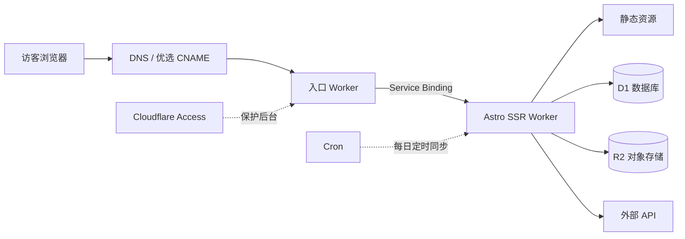
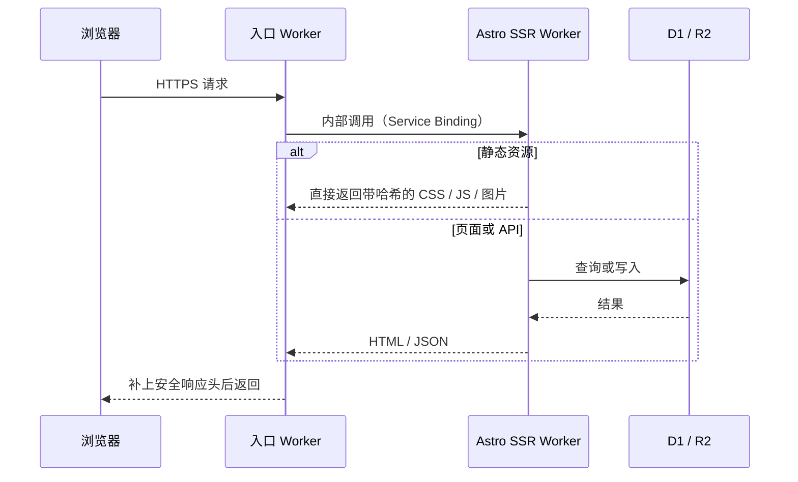

你现在看到的这个站，表面上是个博客，实际上跑着两个 Cloudflare Worker、一个 SQL 数据库和一个对象存储。评论、点赞、浏览量是实时的，书影音收藏有自己的管理后台，听歌排行每天凌晨自动同步。而账单里除了域名，其他部分约等于零。

这篇文章介绍它的结构：请求从哪进来、数据放在哪、图片怎么处理、国内访问为什么不算慢。不是搭建教程，更像一张导览图。如果你也想用 Cloudflare 搭站，文末我会说哪些部分值得抄、哪些不值得。

## 全景

各部分的分工一句话就能说完。入口 Worker 负责接住公开域名的所有流量；Astro SSR Worker 是真正的应用，渲染页面、处理 API；D1 存所有结构化数据；R2 存所有图片；Access 把 `/admin/` 后台挡在 Cloudflare 边缘；Cron 每天触发一次数据同步。

整个站没有传统意义上的服务器。没有固定 IP，没有要打补丁的系统，没有半夜挂掉需要重启的进程。

## 一次请求发生了什么

这里有一个对成本影响最大的细节：命中静态资源的请求不执行代码，也不计入 Workers 的请求额度。CSS、JS、字体、本地图片都属于这类，它们免费且不限量。真正消耗每天 10 万次免费额度的，只有需要跑代码的 HTML 渲染和 API 调用。

所以我的原则是让尽可能多的请求停在静态层。只有 `/api/*`、`/admin/*` 这类必须动态处理的路径才配置成"先过 Worker"。

## 为什么是两个 Worker

入口 Worker 非常薄，加起来不到一百行：校验请求的 Host 是不是我的域名，拒绝明显的跨站写请求，转发给应用 Worker，最后统一补上 HSTS 之类的安全响应头。

它存在的意义不是性能，是解耦。我的公开域名走了国内优选入口（后面会讲），这条链路以后可能会换方案；应用 Worker 则几乎每天都在部署。两边拆开之后，改任何一边都不用碰另一边。转发用的是 Service Binding，也就是 Worker 之间的内部调用，不经过公开 URL，不额外收费，应用 Worker 也因此不需要暴露任何可以被绕过入口直接访问的地址。

如果你的站不需要折腾入口链路，这一层完全可以省掉。

## 数据放在哪

D1 是 Cloudflare 的托管 SQLite，存着这个站所有的结构化数据：评论、点赞、浏览量、书影音收藏的元数据、游戏记录、听歌排行。

用 D1 之前我没关注过一个指标：行读取量。D1 免费额度每天 500 万行，但按的是扫描行数，不是返回行数。一个返回 20 条评论的查询，如果没走索引扫了全表，计的可能是几万行。给常用过滤字段建索引、列表分页，这些老生常谈的优化在 D1 上直接关系到额度还剩多少。

R2 存所有图片：正文插图、收藏封面。选它的决定性原因是出口流量免费，图床最怕的就是流量费。R2 只存文件，文件的来源、归属这些元数据在 D1 里，两边通过对象键关联。

Cron 每天北京时间凌晨四点触发一次：先给网易云的登录 Cookie 续期，再抓一周排行和总排行写进 D1。哪一步失败就保留上次的成功结果，音乐页不会因为一次同步失败而空白。

## 图片管线

我在 Obsidian 里写文章，粘贴图片的瞬间，图床插件把它直接传到 R2，Markdown 里留下的是一个在线 URL。仓库里从头到尾没有图片二进制文件，git 历史不会膨胀。

构建的时候，脚本会为每张首次出现的图生成 AVIF 和 WebP 的多个宽度版本（640 / 1280 / 1920），传回 R2 同目录，并把映射写进 manifest。渲染时 Markdown 里那个 URL 不变，输出的 HTML 却是完整的 `<picture>`：浏览器按视口和像素密度挑最小够用的文件，正文第一张图高优先级加载，其余的懒加载。原图 URL 永远有效，作为兜底。

一个哭笑不得的细节：AVIF 文件在 R2 里的存储键是 `.avif.webp`，返回的 MIME 还是 `image/avif`。因为图床域名的某处会错误拦截 `.avif` 后缀，与其排查那条链路，不如改个后缀绕过去。

## 免费额度的真实边界

"零成本"需要加限定：除域名外、访问量和数据量在免费额度内时，账单约等于零。额度具体是（2026 年 7 月查询的官方数字）：

| 项目 | 免费额度 | 我的用法 |
| --- | --- | --- |
| Workers 动态请求 | 10 万次/天，账户共享 | 静态资源不占，只有 SSR 和 API 消耗 |
| 静态资源请求 | 免费，不限量 | 大部分请求停在这层 |
| D1 | 500 万行读/天，10 万行写/天 | 索引 + 分页，避免全表扫描 |
| R2 | 10 GB 存储，出口流量免费 | 图床和封面库，远用不满 |

两个容易误解的地方：10 万次是整个账户每天的免费上限，不是每个 Worker 各 10 万；D1 按扫描行计数，无索引查询会以你想不到的速度吃掉额度。

我的策略压缩成一句话：静态的不进脚本，进脚本的少扫行，图片在构建时处理完。

## 国内访问

Cloudflare 的默认入口是 Anycast，路由由 BGP 决定，对国内三大运营商不总是友好。同一个站，电信可能很快，移动晚高峰可能绕路丢包。

我的做法是优选 CNAME：把域名 CNAME 到一个会持续测速、更新解析结果的目标域名。要说清楚它是什么：它只改善"浏览器连到 Cloudflare 哪个入口"这第一段路径，TLS 证书还是我自己的，Host 还是我的域名，内容不经过任何第三方解密。它不是国内 CDN，不是备案节点，也不保证所有地区所有时段都更快。第三方服务随时可能失效，所以我保留着一分钟内改回默认 DNS 的回退方案。

进站之后的速度靠缓存分层，规则按"内容多久会变"来定：

- 带内容哈希的 CSS / JS / 字体：缓存一年，`immutable`。文件变了 URL 就变，永远不会读到旧文件。
- HTML：`no-cache`，可以存但每次要重新验证，保证部署后不会拿着旧页面引用已经消失的资源。
- 评论、统计这类动态 API：边缘缓存 15 秒，写请求一律 `no-store`。
- GitHub 热力图缓存 6 小时，WakaTime 缓存 15 分钟。TTL 跟着数据的实际变化频率走。

最后是感知层面的。首页是五个横向页面的 SPA：当前页直出，相邻页在浏览器空闲时预取，鼠标悬停到某个导航时立即预取对应页面。首次加载的遮罩只等两件事：页面完成两帧绘制、首屏第一张图解码完成，不等 `window.load`，因为后者会被懒加载图片和统计请求拖住。

## 哪些值得抄

如果你的站是纯静态博客，Astro 加静态资源托管就够了，一个 Worker 都不需要。架构应该跟着需求长，而不是跟着文章长。

如果你需要评论、后台、定时任务，D1 加 SSR Worker 是我用过的个人项目里维护成本最低的组合。记得看行读取量。

如果国内访问速度困扰你，先花一个晚上分运营商实测，再决定要不要上优选。无论上不上，都把回退路径留好。

## 参考

- [Workers 平台限制](https://developers.cloudflare.com/workers/platform/limits/)
- [静态资源计费规则](https://developers.cloudflare.com/workers/static-assets/billing-and-limitations/)
- [Service Bindings](https://developers.cloudflare.com/workers/runtime-apis/bindings/service-bindings/)
- [D1 定价](https://developers.cloudflare.com/d1/platform/pricing/)
- [R2 定价](https://developers.cloudflare.com/r2/pricing/)
- [MDN：Cache-Control](https://developer.mozilla.org/docs/Web/HTTP/Reference/Headers/Cache-Control)
