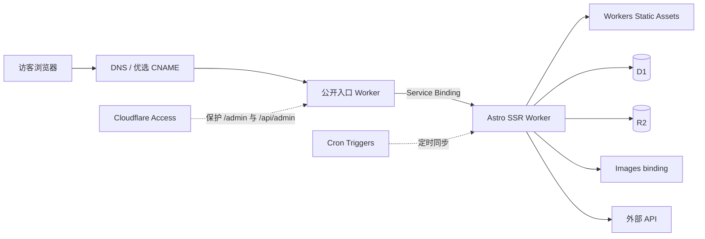
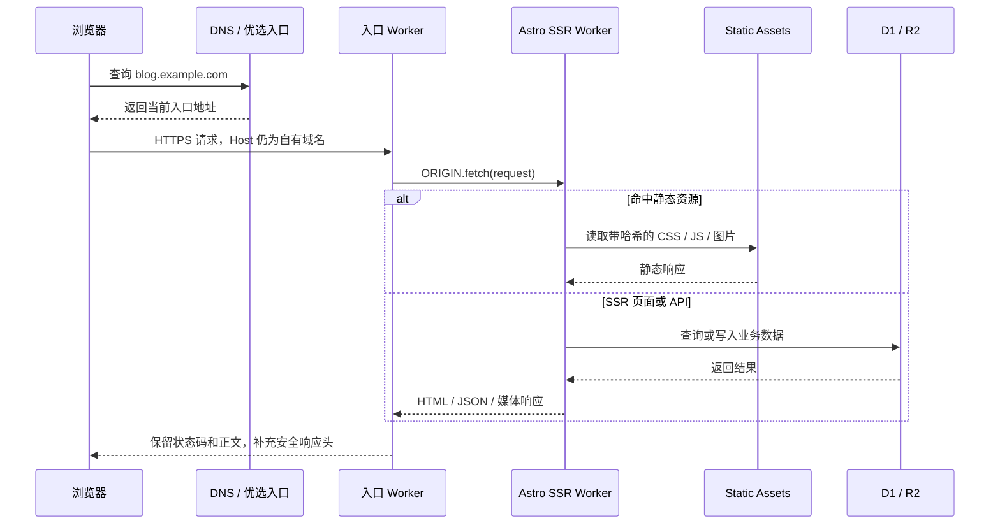

# Cloudflare 零成本网站架构系列：从基础概念到国内访问优化

	## 部分名词解释

| 概念              | 通俗解释                                       | 在本文架构里的角色                            |
| --------------- | ------------------------------------------ | ------------------------------------ |
| CDN             | 把内容放到离访客更近的节点，并复用缓存                        | 承载静态资源和边缘缓存，减少重复回源                   |
| 边缘节点            | CDN 在各地的接入与计算节点                            | 接收请求、终止 TLS、执行 Worker、命中缓存           |
| Worker          | ∂在 Cloudflare 边缘的 JavaScript/TypeScript 服务 | 入口 Worker 负责公开入口，Astro Worker 负责应用逻辑 |
| D1              | Cloudflare 的托管 SQL 数据库                     | 保存评论、互动统计、收藏元数据和同步结果                 |
| R2              | 兼容对象存储思路的文件仓库                              | 保存正文图片、收藏封面等大对象                      |
| Service Binding | 一个 Worker 调用另一个 Worker 的内部连接               | 入口 Worker 不经公开 URL，直接调用 Astro Worker |


### 总体架构



### 一次请求实际发生了什么



---

# 上篇：我如何用 Cloudflare 零成本搭建个人网站

**摘要：** 这篇文章复盘我的个人网站从 Astro + Cloudflare Pages，演进到“薄入口 Worker + Astro SSR Worker + D1 + R2”的过程。

**TAGS：** `Cloudflare`、`Astro`、`Workers`、`D1`、`R2`、`个人网站`、`Serverless`

## 开场：我想要的不是一张永远不变的网页

最开始，这个站只是一个很典型的 Astro 内容站：Markdown 写文章，构建后交给 Cloudflare Pages，静态文件放在边缘网络里。对纯博客来说，这个组合已经很好。页面简单、部署省心，也没有需要维护的服务器。

问题出现在我开始往站里加入“会变化的东西”之后：评论、点赞、浏览量、收藏管理、游戏记录、音乐同步、管理后台。这些功能不再是构建时可以一次性生成的 HTML。它们需要 API，需要数据库，需要定时任务，还需要只允许我进入的后台。

我没有因此购买 VPS，而是顺着 Cloudflare 已有的能力继续往前走。最后形成的结构是：静态资源仍然由边缘直接分发，Astro 以 SSR Worker 方式运行，D1 保存结构化数据，R2 保存图片，最外面再放一个很薄的入口 Worker。

“零成本”也要先加限定：**除域名外、个人站访问量和数据量处于免费额度内时，账单可以近似为 0 元。** 域名续费、第三方优选服务、翻译或音乐等外部 API、GitHub 之外的 CI 资源，以及任何超额使用，都不在这个承诺里。

## 一、架构是怎样一步一步长出来的

### 1. Astro + Pages：纯内容站的舒服起点

第一阶段只有页面、文章、样式和图片。Astro 很适合把内容在构建阶段变成 HTML，Cloudflare Pages 则负责部署和分发。这个阶段没有数据库，也没有真正的服务端状态。

如果你的站点到这里就够用，我并不建议为了“架构感”强行加入两个 Worker。静态站越简单越好。架构演进应该由需求推动，而不是由产品列表推动。

### 2. 评论与互动出现：D1 和服务端 API 进入系统

评论、点赞和浏览量要求数据在部署之外持续存在。D1 在这里承担 SQL 数据库职责：评论正文、显示状态、互动计数、内容稳定 ID、限频摘要都放在表中。后来收藏元数据、游戏和音乐同步结果也进入 D1。

使用 D1 后，我开始关注一个之前不存在的指标：行读取量。D1 免费额度按“读取和扫描了多少行”计数，不是只看最终返回几行。给常用过滤字段建立索引、给列表分页、避免无条件全表扫描，会同时改善性能和额度消耗。

### 3. 图片不适合塞进数据库：R2 接管大对象

数据库适合结构化记录，不适合存放大量图片字节。正文图片和收藏封面进入 R2，D1 只保存对象键、来源和元数据。这样一条收藏记录可以更新标题或评分，而不必重写图片；图片也可以使用长缓存和独立域名。

本站当前把正文图与收藏封面放在 R2。正文栅格图在构建阶段生成 AVIF/WebP 和多种宽度，运行时通常只是直接分发已经生成好的对象。Images binding 只留给确实需要运行时转换的外部头像等场景，避免把所有图片请求都变成动态转换。

### 4. 从 Pages 迁移到 Astro SSR Worker

当 SSR 页面、API、Cron 和多个运行时 binding 成为核心能力后，我把应用统一迁移到 Astro SSR Worker。当前仓库使用 Astro 7、`@astrojs/cloudflare` 适配器和 `output: "server"`，Worker 的 `fetch` 入口交给 Astro handler，`scheduled` 入口执行游戏和音乐同步。

这次迁移的价值不是“Worker 比 Pages 更高级”，而是让页面渲染、API、定时任务和 binding 位于同一个明确的运行时模型中。静态资源并没有因此变成昂贵的动态请求，Workers Static Assets 仍然可以优先直接返回匹配文件。

### 5. 曾经的公开 HTTP 回源：能用，但边界不干净

迁移过程中，我一度让外层代理 Worker 通过公开的 `pages.dev` 地址请求应用。它可以工作，但有三个问题：应用源地址需要公开；内部调用绕到公开 URL；入口与应用之间的信任边界依赖额外的 Host、Origin 和鉴权处理。

后来我把这条链路替换成 Service Binding。入口 Worker 声明一个 `ORIGIN` binding，然后执行 `env.ORIGIN.fetch(request)`。Cloudflare 官方把它定义为 Worker 到 Worker 的内部调用，不需要公开可访问 URL；默认情况下两个 Worker 可以在同一 Cloudflare 服务器、同一线程中执行，官方也明确说明这种拆分不会增加 Service Binding 费用。

### 6. 当前结构：薄入口 + 完整应用

现在入口 Worker 只做少量稳定工作：校验公开 Host、拒绝明显的跨站写请求、调用应用 Worker、统一安全响应头、写入一个便于排查的响应头。Astro Worker 负责真正的页面、API、静态资源路由、数据库和对象存储。

这两个 Worker **不是为了把一份计算做两遍，也不是为了凭空加速 SSR**。它们的价值是分离：

- 公开域名与国内入口策略可以变化，而应用 Worker 不必跟着改。
- 应用可以频繁部署，入口 Worker 没变化时不必重发。
- 外层可以统一处理 Host、跨站写入和安全头。
- 应用 Worker 不需要把公开 URL 当成内部接口。
- 将来替换优选链路时，业务代码和数据 binding 不受影响。

## 二、每个 Cloudflare 产品在本站负责什么

### Workers Static Assets

`/_astro/*` 下带内容哈希的 CSS、JS，以及字体和本地内容图片由 Static Assets 承载。Cloudflare 官方文档说明，匹配到静态资源的请求免费且不计入 Worker 脚本请求额度；只有调用 SSR 脚本的请求才按 Workers 计量。

`run_worker_first` 只覆盖必须经过应用的路径，例如 `/api/*`、`/admin/*`、动态收藏页和媒体路由。不要把它无差别设为 `true`，否则本可直接返回的静态文件也会调用 Worker。

### Astro SSR Worker

它负责：SSR 页面、Astro API 路由、Access JWT 二次验证、D1/R2/Images binding、Cache API、定时同步和响应头。它是应用，不是传统意义上一台固定 IP 的服务器。

### D1

D1 保存评论、浏览量、点赞、内容 ID、收藏元数据、游戏记录和音乐同步结果。写接口返回 `no-store`；评论列表和统计读取允许很短的边缘缓存，以减少热门内容产生的重复查询。

### R2

R2 保存正文图片与收藏封面。R2 Standard 免费档包含存储和操作额度，并且直接从 R2、Workers API、S3 API 或 `r2.dev` 产生的互联网出口不收费。但“R2 出口免费”不等于“Cloudflare 所有产品和所有组合都无限免费”；接入其他计费服务仍可能产生费用。

### Images binding

本站只在需要运行时拉取并统一转换外部头像时使用 Images binding。正文图片优先在构建阶段处理，避免同一张图的尺寸、参数组合不断增加“唯一转换”数量。

### Cloudflare Access

Access 在 Cloudflare 边缘保护 `/admin/*` 和 `/api/admin/*`。应用内部仍读取 `Cf-Access-Jwt-Assertion`，使用团队域名提供的 JWKS 验证签名，并验证 Issuer 和 Audience。这样即使某条源地址意外暴露，后台也不会只依赖“外面应该已经拦过了”这一假设。

## 三、“近似 0 元”的真实边界

以下数据来自 Cloudflare 官方定价或限制文档，查询日期为 2026-07-28：

| 产品 | Free 额度 | 对个人站意味着什么 |
| --- | --- | --- |
| Workers 动态请求 | 100,000 次/天，00:00 UTC 重置 | HTML SSR、API 和其他脚本调用共享账户额度；超限会失败 |
| Static Assets | 请求免费且不限量，不计 Worker 脚本请求 | 带哈希的 CSS、JS、字体和本地图片应尽量直接走静态资源 |
| D1 | 5,000,000 行读取/天；100,000 行写入/天；总存储 5 GB | 个人评论和统计通常够用，但无索引扫描可能快速浪费读取额度 |
| R2 Standard | 10 GB-month/月；100 万 Class A/月；1,000 万 Class B/月 | 小型图床和封面库通常有余量；免费档不适用于 Infrequent Access |
| R2 互联网出口 | 免费 | 不收传统对象存储出口费，但其他计费服务仍按各自规则计费 |
| Images Free | 5,000 个唯一转换/月 | 适合少量头像或固定规格，不适合无限组合参数 |

这里有两个容易被忽略的细节。第一，Workers 的 100,000 次是账户免费计划的每日请求限制，不应简单理解为“每个 Worker 各 100,000 次”。第二，D1 的读取按扫描行计算；一个返回 20 条记录的查询，如果扫描了 50,000 行，计量不会只算 20 行。

因此我的“零成本策略”不是祈祷账单永远为零，而是：让静态文件不调用脚本；减少数据库扫描；图片在构建时生成固定规格；动态数据设置与变化频率相称的短缓存；在 Dashboard 里观察 Workers、D1、R2 和 Images 指标。

## 四、从零复现：最小可运行版本

以下命令和配置使用占位符。`<ACCOUNT_ID>`、`<DATABASE_ID>`、`<YOUR_DOMAIN>` 等必须替换；不要把真实 Token 或数据库 UUID 提交到仓库。

### 1. 初始化 Astro 与 Cloudflare 适配器

```bash
npm create astro@latest my-site
cd my-site
npx astro add cloudflare
npm install
```

一个精简的 `astro.config.mjs`：

```js
import { defineConfig } from "astro/config";
import cloudflare from "@astrojs/cloudflare";

export default defineConfig({
  site: "https://<YOUR_DOMAIN>",
  output: "server",
  adapter: cloudflare({
    imageService: "compile",
    configPath: "./wrangler.astro.jsonc",
  }),
});
```

`imageService: "compile"` 表示可在构建阶段完成 Astro 管理图片处理。本站正文图片还有一套自己的 R2 同步与响应式 manifest 流程；这不是搭起核心架构的必要条件。

### 2. 创建 D1 和 R2

```bash
npx wrangler d1 create <DATABASE_NAME>
npx wrangler r2 bucket create <BUCKET_NAME>
```

保存 D1 命令返回的 `database_id`，但只放进部署配置，不要在公开文章里使用生产 UUID。数据库迁移可以这样执行：

```bash
npx wrangler d1 execute <DATABASE_NAME> --remote --file=./schema.sql
```

### 3. 主 Astro Worker 配置

下面是“本站实际策略的精简版本”，文件名为 `wrangler.astro.jsonc`：

```jsonc
{
  "$schema": "./node_modules/wrangler/config-schema.json",
  "name": "<APP_WORKER_NAME>",
  "main": "src/worker.ts",
  "compatibility_date": "2026-07-28",
  "compatibility_flags": ["nodejs_compat"],
  "keep_vars": true,
  "triggers": {
    "crons": ["0 20 * * *"]
  },
  "images": {
    "binding": "IMAGES"
  },
  "assets": {
    "binding": "ASSETS",
    "html_handling": "auto-trailing-slash",
    "not_found_handling": "none",
    "run_worker_first": [
      "/api/*",
      "/admin/*",
      "/media/*"
    ]
  },
  "d1_databases": [
    {
      "binding": "DB",
      "database_name": "<DATABASE_NAME>",
      "database_id": "<DATABASE_ID>"
    }
  ],
  "r2_buckets": [
    {
      "binding": "MEDIA_BUCKET",
      "bucket_name": "<BUCKET_NAME>"
    }
  ]
}
```

Astro 入口可以同时实现 `fetch` 和 `scheduled`：

```ts
import { handle } from "@astrojs/cloudflare/handler";

export default {
  fetch(request: Request, env: Cloudflare.Env, ctx: ExecutionContext) {
    return handle(request, env, ctx);
  },

  scheduled(_controller, env, ctx) {
    ctx.waitUntil(runScheduledSync(env));
  },
} satisfies ExportedHandler<Cloudflare.Env>;
```

如果暂时没有定时任务，删除 `triggers` 和 `scheduled` 即可。不要为了与示例一致而保留空壳。

### 4. 入口 Worker 配置

Service Binding 配置写在**调用方**，也就是入口 Worker：

```jsonc
{
  "$schema": "./node_modules/wrangler/config-schema.json",
  "name": "<ENTRY_WORKER_NAME>",
  "main": "workers/entry.js",
  "compatibility_date": "2026-07-28",
  "services": [
    {
      "binding": "ORIGIN",
      "service": "<APP_WORKER_NAME>"
    }
  ],
  "routes": [
    {
      "pattern": "<YOUR_DOMAIN>/*",
      "zone_name": "<YOUR_ZONE>"
    }
  ]
}
```

最小入口实现：

```js
const SECURITY_HEADERS = {
  "strict-transport-security": "max-age=31536000; includeSubDomains",
  "x-content-type-options": "nosniff",
  "x-frame-options": "DENY",
  "referrer-policy": "strict-origin-when-cross-origin",
};

function isSameOriginRequest(request) {
  const origin = request.headers.get("origin");
  const isCrossSite = request.headers.get("sec-fetch-site") === "cross-site";
  return !isCrossSite && (!origin || origin === new URL(request.url).origin);
}

export default {
  async fetch(request, env) {
    const url = new URL(request.url);
    if (url.hostname !== "<YOUR_DOMAIN>") {
      return new Response("Not Found", { status: 404 });
    }

    if (["POST", "PUT", "PATCH", "DELETE"].includes(request.method)
        && !isSameOriginRequest(request)) {
      return Response.json(
        { error: { code: "FORBIDDEN_REQUEST" } },
        { status: 403 },
      );
    }

    const response = await env.ORIGIN.fetch(request);
    const headers = new Headers(response.headers);
    for (const [name, value] of Object.entries(SECURITY_HEADERS)) {
      headers.set(name, value);
    }
    headers.set("x-site-edge", "entry-worker");

    return new Response(response.body, {
      status: response.status,
      statusText: response.statusText,
      headers,
    });
  },
};
```

这层同源检查只能作为纵深防御，不能替代应用自己的 CSRF、输入校验、鉴权和权限控制。尤其是后台接口，仍应验证 Access JWT。

### 5. Secret 与 Access

Secret 使用 Wrangler 写入，不要写进 JSONC：

```bash
npx wrangler secret put COMMENT_HASH_SALT --name <APP_WORKER_NAME>
npx wrangler secret put CF_ACCESS_TEAM_DOMAIN --name <APP_WORKER_NAME>
npx wrangler secret put CF_ACCESS_AUD --name <APP_WORKER_NAME>
```

在 Zero Trust 中创建 Self-hosted Access Application，同时覆盖：

```text
https://<YOUR_DOMAIN>/admin/*
https://<YOUR_DOMAIN>/api/admin/*
```

外层 Access 策略限制允许登录的人，应用层再验证 `Cf-Access-Jwt-Assertion` 的签名、Issuer、Audience 与有效期。两层都要保留。

### 6. 部署顺序

第一次部署必须先有被调用方，后有调用方：

```bash
npm run build
npx wrangler deploy --config dist/server/wrangler.json
npx wrangler deploy --config wrangler.entry.jsonc
```

原因很直接：入口配置中的 Service Binding 必须能找到目标 Worker。日常如果只改 Astro 应用，通常只部署主 Worker；只有入口代码、路由或 Service Binding 改变时才部署入口 Worker。

### 7. GitHub Actions

以下是最小可复现工作流。它明确保持“先应用、后入口”的顺序：

```yaml
name: Deploy Cloudflare Workers

on:
  push:
    branches: [main]
  workflow_dispatch:

jobs:
  deploy:
    runs-on: ubuntu-latest
    permissions:
      contents: read
    env:
      CLOUDFLARE_API_TOKEN: ${{ secrets.CLOUDFLARE_API_TOKEN }}
      CLOUDFLARE_ACCOUNT_ID: ${{ secrets.CLOUDFLARE_ACCOUNT_ID }}
    steps:
      - uses: actions/checkout@v4
      - uses: actions/setup-node@v4
        with:
          node-version: 22
          cache: npm
      - run: npm ci
      - run: npm run build
      - name: Deploy Astro application Worker
        run: npx wrangler deploy --config dist/server/wrangler.json
      - name: Deploy public entry Worker
        run: npx wrangler deploy --config wrangler.entry.jsonc
```

两条部署命令使用相同的 job 级环境变量。API Token 只授予部署实际需要的账户、Workers、D1、R2 权限，不使用 Global API Key。日常若入口 Worker 没有变化，可以删除第二个部署步骤，避免无意义重发；首次创建或修改入口配置时再按完整顺序部署。

## 五、上线后怎样确认没有“看起来能用”

```bash
# 域名是否解析到预期入口
dig <YOUR_DOMAIN> A
dig <YOUR_DOMAIN> AAAA
dig <YOUR_DOMAIN> CNAME

# 入口 Worker 是否实际执行
curl -I https://<YOUR_DOMAIN>/

# 静态资源是否长期缓存
curl -I https://<YOUR_DOMAIN>/_astro/<HASHED_FILE>.js

# HTML 是否重新验证，而不是缓存一年
curl -I https://<YOUR_DOMAIN>/blog/example/

# API 写请求是否 no-store
curl -i -X POST https://<YOUR_DOMAIN>/api/view \
  -H 'content-type: application/json' \
  --data '{"contentId":"blog/example"}'
```

我会检查 `x-site-edge` 是否存在、静态资源是否有 `immutable`、HTML 是否为 `no-cache` 或等价的重新验证策略、写接口是否为 `no-store`，以及后台未登录时是否被 Access 或应用返回 401。

## 总结

这套架构最值得复用的不是“用了多少 Cloudflare 产品”，而是边界清楚：静态资源直接分发；动态应用集中在 Astro Worker；结构化数据进 D1；文件进 R2；少量运行时图片转换才进 Images；后台由 Access 和应用 JWT 双重校验；公开入口与业务应用通过 Service Binding 解耦。

如果网站只是纯静态博客，一层 Astro + Static Assets 就够了。如果已经需要评论、后台、定时任务和国内入口调整，“薄入口 + 应用 Worker”才开始体现价值。复杂度应当跟着真实需求增长。

## 参考资料

- Workers limits: https://developers.cloudflare.com/workers/platform/limits/
- Workers Static Assets billing: https://developers.cloudflare.com/workers/static-assets/billing-and-limitations/
- Static Assets binding 与 `run_worker_first`: https://developers.cloudflare.com/workers/static-assets/binding/
- Service Bindings: https://developers.cloudflare.com/workers/runtime-apis/bindings/service-bindings/
- D1 pricing: https://developers.cloudflare.com/d1/platform/pricing/
- R2 pricing: https://developers.cloudflare.com/r2/pricing/
- Images pricing: https://developers.cloudflare.com/images/pricing/
- Cron Triggers: https://developers.cloudflare.com/workers/configuration/cron-triggers/
- Cloudflare Access JWT: https://developers.cloudflare.com/cloudflare-one/access-controls/applications/http-apps/authorization-cookie/
- Astro Cloudflare adapter: https://docs.astro.build/en/guides/integrations-guide/cloudflare/

---

# 下篇：面向国内网络，我如何优化访问链路与网站流畅度

**摘要：** 国内访问一个部署在 Cloudflare 全球网络上的个人网站，慢的原因可能在 DNS、TCP/TLS、跨境链路、边缘入口、SSR、资源体积、图片解码或首屏调度中的任何一层。本文说明优选 IP/CNAME 到底优化了什么、没有解决什么，并复盘本站如何通过缓存、响应式图片、延迟加载、按意图预取和部署版本刷新改善实际与感知速度。文章不会公开或推荐当前使用的第三方优选服务。

**推荐标签：** `Cloudflare`、`国内访问优化`、`CDN`、`Web 性能`、`Core Web Vitals`、`缓存`、`Astro`

## 开场：一次 ping 很快，不代表网站真的快

我最早优化国内访问时，很容易盯着一个数字：延迟。找到一个 ping 更低的地址，似乎就完成了优化。但浏览器打开页面经历的是 DNS 查询、TCP 连接、TLS 握手、HTTP 请求、服务端等待、资源下载、解析执行、图片解码和绘制。任何一段都可能成为瓶颈。

因此我现在把“快”拆成三类：

1. **网络速度**：DNS、TCP/TLS、跨境链路和进入 Cloudflare 的边缘入口。
2. **实际加载速度**：资源体积、请求数量、缓存命中、SSR 与数据库等待。
3. **感知速度**：首屏优先级、布局稳定性、渐进加载和交互反馈。

优选 CNAME 主要碰第一类；缓存和图片处理主要碰第二类；加载遮罩、懒加载和交互反馈主要碰第三类。只做其中一个，不会自动解决其他两类问题。

## 一、Anycast 与默认 Cloudflare 入口

Cloudflare 的很多公开地址采用 Anycast：多个边缘位置通告相同 IP，互联网路由根据 BGP 等策略把用户带到某个入口。它的优势是全球部署简单、故障可以转移，但“网络选择的入口”不保证等于“对某个国内运营商、某个地区、某个时段体感最好的入口”。

国内移动、联通、电信之间，南北地区之间，IPv4 与 IPv6 之间，甚至白天与晚高峰之间，都可能出现不同结果。默认入口在某些网络很好，在另一些网络可能抖动、绕路或丢包。这里的波动并不能仅归因于 Cloudflare，也涉及本地运营商、互联和跨境路径。

## 二、优选 IP、优选 CNAME 和普通 CDN 有什么区别

### 优选 IP

优选 IP 是从仍能承载相同 Cloudflare 服务的一组地址中，测试出当前网络表现相对较好的地址。它改变“浏览器先连到哪里”，但 HTTP Host 和 TLS SNI 仍应是自己的域名。

直接固定 IP 的问题是维护成本高：今天的结果不代表下周仍然有效，IPv4 与 IPv6 也要分别处理。手工把域名长期钉死在一次测速的 IP 上，通常不是可持续方案。

### 优选 CNAME

优选 CNAME 把维护入口地址的工作交给一个目标域名。自己的域名 CNAME 到 `<preferred-cname.example>`，第三方可以更新其解析结果。浏览器请求的仍是自己的域名，证书和 Host 仍由自己的 Cloudflare 配置处理。

这并不意味着第三方拿到了我的站点证书，也不意味着内容先被一个普通反向代理解密。正确链路中，CNAME 只影响 DNS 解析和入口选择；HTTPS 终止仍在 Cloudflare，访问域名仍是自己的域名。是否满足这一点必须用证书、响应头和链路测试验证，不能靠宣传语判断。

### 普通 CDN

普通 CDN 往往会实际代理、缓存或回源内容，需要在该 CDN 配置域名、证书、回源和缓存规则。优选 CNAME 在本文方案中更像“选一个进入 Cloudflare 国际网络的入口”，不是再套一层完整 CDN。

### 它不是什么

这套方案不等同于中国大陆节点，不等同于完成 ICP 备案后的境内 CDN，也不等同于 Cloudflare China Network。它只是尝试改善进入 Cloudflare 国际网络的第一段路径，无法消除所有跨境不确定性，也不能承诺所有省份、运营商和时间段一定更快。

## 三、DNS 配置只公开通用框架

我不会公开或推荐本站当前使用的第三方优选服务域名。示例统一使用：

| 类型 | 名称 | 目标 | 代理状态 |
| --- | --- | --- | --- |
| CNAME | `blog` | `<preferred-cname.example>` | 按该方案说明配置并实测 |

很多优选 CNAME 方案要求 DNS only，因为再次启用常规代理可能让 Cloudflare DNS 返回默认 Anycast 地址，从而抹掉“优选”结果；也有基于 Cloudflare SaaS、自定义主机名或其他机制的方案，要求并不相同。因此我不会给出一个对所有服务都正确的橙云/灰云结论。

我会坚持四个验证条件：

- 地址栏和请求 Host 始终是 `blog.example.com`，没有跳转到第三方域名。
- 浏览器看到的证书覆盖 `blog.example.com`，签发与续期仍由自己的 Cloudflare 配置控制。
- 响应包含我在入口 Worker 添加的 `x-site-edge`，证明请求进入了自己的 Worker。
- 第三方服务失效时有回退方案，可以快速改回默认 Cloudflare DNS 入口。

第三方优选链路没有 Cloudflare 官方 SLA。对方可能停服、修改策略、污染解析、只优化部分地区，甚至在域名过期后被他人接管。使用前应评估运营者、解析记录、TTL、隐私和回退成本。

## 四、怎样测试，才不会被单次结果误导

### 1. 先记录 DNS 与连接对象

```bash
dig blog.example.com CNAME
dig blog.example.com A
dig blog.example.com AAAA

curl -sSvo /dev/null https://blog.example.com/ 2>&1 \
  | sed -n '/Connected to/p;/SSL connection/p'
```

测试时保留时间、网络、地区、运营商、IPv4/IPv6 和解析结果。否则“昨天快、今天慢”没有可比较的上下文。

### 2. 分解一次请求的时间

```bash
curl -o /dev/null -sS \
  -w 'dns=%{time_namelookup}\nconnect=%{time_connect}\ntls=%{time_appconnect}\nttfb=%{time_starttransfer}\ntotal=%{time_total}\nremote_ip=%{remote_ip}\nhttp=%{http_code}\n' \
  https://blog.example.com/
```

这些指标分别帮助判断：DNS 是否慢、TCP 是否慢、TLS 是否慢、服务端首字节是否慢、总下载是否慢。至少连续测多次，比较中位数和高分位，而不是挑最好的一次截图。

### 3. 强制 IPv4 和 IPv6

```bash
curl -4 -o /dev/null -sS -w '%{remote_ip} %{time_total}\n' https://blog.example.com/
curl -6 -o /dev/null -sS -w '%{remote_ip} %{time_total}\n' https://blog.example.com/
```

如果 IPv6 明显不稳定，就要单独检查 AAAA 链路，不能用 IPv4 的好结果替 IPv6 作结论。

### 4. 用浏览器看真实页面

Chrome/Edge DevTools 的 Network 面板比 ping 更接近用户体验。我会观察：Document 的 TTFB、关键 CSS/JS 是否阻塞、图片是否选择了合适尺寸、静态资源是否来自 memory/disk cache、是否有重复 API、页面切换是否意外下载全部路由。

WebPageTest 可以选择不同地区和连接条件，适合看瀑布图、首屏视频、LCP、CLS 和重复访问缓存。国内真实体验仍应使用本地三网设备补测。

### 5. 建议测试矩阵

| 维度 | 至少覆盖 |
| --- | --- |
| 运营商 | 移动、联通、电信 |
| IP 协议 | IPv4、IPv6 |
| 地区 | 华北、华东、华南或自己的主要访客地区 |
| 时间 | 工作日白天、晚高峰、周末 |
| 页面 | 首页、长文章、图片较多页面、带动态 API 页面 |
| 缓存 | 首次访问、重复访问、部署后首次访问 |

ping 和 traceroute 可以辅助发现丢包或绕路，但 ICMP 可能被限速或走不同策略，不能作为网站性能最终结论。

## 五、本站的缓存策略：按变化速度分层

### 1. 一年缓存：只有内容寻址的资源

构建产物中的 CSS、JS 文件名带内容哈希，内容变化时 URL 也变化，因此使用：

```text
Cache-Control: public, max-age=31536000, immutable
```

字体和由构建流程生成、URL 稳定表示特定内容版本的图片也可以采用相同策略。浏览器不必反复确认旧文件是否变化，新部署则通过新 URL 自然获取新文件。

### 2. 短缓存：可能在相同 URL 下替换的图片

普通 `/images/*` 只缓存一天；头像这类可能原地替换的文件使用 `max-age=0, must-revalidate`。关键不是选择“一天”这个神奇数字，而是不要给会在相同 URL 下变化的文件标记一年 `immutable`。

### 3. HTML：`no-cache`，不是“不允许存储”

本站 HTML 使用 `Cache-Control: no-cache`。浏览器可以保存副本，但复用前必须重新验证。这样部署后的 HTML 不会长期引用已经变化的资源，同时仍保留条件请求的可能。

`no-cache` 与 `no-store` 不同。前者要求重新验证，后者要求不要存储。登录后台、写接口和包含敏感数据的响应适合 `no-store`。

### 4. `version.json`：部署变化后只刷新一次

构建时生成：

```json
{"buildId":"<GIT_COMMIT_SHA>"}
```

该文件使用 `Cache-Control: no-store`。浏览器定期、重新聚焦或恢复可见时检查版本；发现 build ID 变化后，把目标版本写入 `sessionStorage` 并刷新。相同目标版本只触发一次，避免刷新循环。

它解决的是长时间打开的 SPA 仍持有旧 HTML 和旧脚本的问题，不是让所有页面每分钟强制重载。

### 5. 动态 API：内部短缓存，客户端不长期保存

评论列表和统计 GET 请求使用 Cloudflare Cache API 做 15 秒边缘缓存。实现上，内部缓存副本带 `max-age=15`，返回给浏览器的响应仍设为 `no-store`，并通过 `x-edge-cache: HIT/MISS` 观察命中。

```js
const cached = await caches.default.match(key);
if (cached) return withClientNoStore(cached, "HIT");

const fresh = await loadFromD1();
ctx.waitUntil(caches.default.put(
  key,
  new Response(fresh.clone().body, {
    ...fresh,
    headers: { "cache-control": "public, max-age=15" },
  }),
));
return withClientNoStore(fresh, "MISS");
```

点赞、浏览量和评论发布等写请求一律 `no-store`。短缓存意味着写入后最多存在一个很短的展示延迟，这是减少重复 D1 读取与实时性之间的明确权衡。

### 6. 外部数据按更新频率缓存

GitHub 热力图数据在边缘缓存 6 小时，WakaTime 数据缓存 15 分钟。GitHub 贡献图没有必要每个访客都实时抓取；WakaTime 更新更频繁，所以 TTL 更短。缓存时间应来自业务变化速度，不应把一个全站统一 TTL 套在所有数据上。

### 7. `_headers` 的最小分层示例

```text
/_astro/*
  Cache-Control: public, max-age=31536000, immutable

/fonts/*
  Cache-Control: public, max-age=31536000, immutable

/images/content/*
  Cache-Control: public, max-age=31536000, immutable

/images/*
  Cache-Control: public, max-age=86400

/avatar.webp
  Cache-Control: public, max-age=0, must-revalidate

/version.json
  Cache-Control: no-store

/blog/*
  Cache-Control: no-cache
```

这是“本站实际策略的精简版本”。SSR 路由还可以在 Astro middleware 或页面中设置响应头；不要假设 `_headers` 会自动覆盖所有 Worker 动态响应。

## 六、图片优化：减少字节，也减少无意义的连接

### 1. 构建阶段生成固定宽度

正文栅格图生成不放大的 `640 / 1280 / 1920 / 原图宽度` 版本，并输出 AVIF 与 WebP。渲染时使用 `<picture>`、`srcset` 和 `sizes`，浏览器根据视口与设备像素比选择合适文件，同时保留 WebP 或原图回退。

```html
<picture>
  <source type="image/avif"
    srcset="image-w640.avif 640w, image-w1280.avif 1280w, image-w1920.avif 1920w"
    sizes="(max-width: 48rem) calc(100vw - 2rem), 46rem">
  <source type="image/webp"
    srcset="image-w640.webp 640w, image-w1280.webp 1280w, image-w1920.webp 1920w"
    sizes="(max-width: 48rem) calc(100vw - 2rem), 46rem">
  
</picture>
```

写明 `width` 和 `height` 可以提前保留布局空间，减少 CLS。生成现代格式不是越小越好，还要校验视觉质量和透明通道。

### 2. 第一张图优先，其余懒加载

本站把正文第一张图片设为 `loading="eager"`、`fetchpriority="high"`，其余图片为 `loading="lazy"`，所有图片使用异步解码。首页首屏头像同样高优先级。

“第一张正文图”只是当前内容模板的启发式规则。如果文章开头先出现一个很小的装饰图，就应该根据真正的 LCP 候选调整，而不是机械地永远提高第一个 ``。

### 3. 只有真的需要 R2 图片域名时才 preconnect

`preconnect` 会提前建立 DNS、TCP 和 TLS，但这本身也消耗连接资源。本站只在正文包含 R2 图片域名时输出 `preconnect` 和 `dns-prefetch`。没有外部正文图的页面不提前连接图片域名。

## 七、延后非首屏数据，但不把页面做成空壳

GitHub 热力图在加载遮罩隐藏后或浏览器空闲时请求；WakaTime 通过服务端代理与缓存返回；评论列表只有接近视口时才加载；浏览量写入也在空闲回调中执行。

这种策略的原则是：文章标题、正文和导航先可用，动态统计随后渐进出现。评论区本来就在正文之后，提前阻塞首屏没有意义。但延迟加载不能没有占位和失败状态，否则布局突然跳动，或接口失败后用户只看到空白。

## 八、首页 SPA 的预取：先邻居，再远处，用户意图最高

本站首页包含五个横向主页面。初始 HTML 只完整加载当前页；相邻页在浏览器空闲时加载；其余页面等待 3 秒，再按距离逐个处理。如果用户在等待前已经悬停、键盘聚焦或触摸某个主导航，则立即预取对应页面。

```text
优先级 1：当前页面
优先级 2：用户 pointerenter / focusin / touchstart 指向的页面
优先级 3：当前页相邻页面，requestIdleCallback
优先级 4：3 秒后的剩余页面，一次一个
```

这样做避免了两种极端：点击后才从零请求，导致页面切换明显停顿；或者首屏一打开就并发下载所有路由，抢占关键 CSS、图片和 API。

预取必须尊重页面数量和用户网络。五个轻量主页面可以做分级预取，几十个文章详情页则不应全部预取。必要时还应参考 `Save-Data`、连接类型和页面可见状态。

## 九、加载遮罩应该等“可用内容”，不是等整个世界

本站首次加载遮罩等待两个条件：页面至少完成两帧绘制；首要高优先级图片完成解码或到达短超时。它还有总超时兜底。遮罩不会等待 `window.load`，因为后者可能被懒加载图片、统计请求和第三方资源拖住。

加载动画只能提供状态反馈，不能把慢请求变快。一个旋转图标遮住 5 秒空白，性能仍然是 5 秒。正确顺序是先缩短关键路径，再用遮罩避免未绘制内容闪烁，并尽快让导航和正文可操作。

## 十、我踩过或刻意避免的误区

### 误区 1：只要优选了，国内所有人都会更快

不同运营商、地区和时间段可能完全相反。结论必须写成“在测试矩阵中改善了某些网络”，不能写成普遍保证。

### 误区 2：第三方优选 CNAME 就是 Cloudflare 官方中国节点

不是。它没有自动获得境内 CDN、备案链路或 Cloudflare China Network 的属性。宣传时混淆这些概念，会让读者对合规、SLA 和链路位置产生错误预期。

### 误区 3：给所有资源缓存一年

带哈希且不可变的资源可以；HTML、头像和同 URL 替换图片不可以。错误的长期缓存会让一次部署问题持续一年。

### 误区 4：把所有页面和图片全预加载

预加载会抢带宽、占连接、消耗流量和内存。优先加载真正决定 LCP 和下一步交互的资源，其他内容按视口、空闲时间和用户意图处理。

### 误区 5：R2 出口免费，所以整套架构无限免费

R2 仍有存储和操作计量，Workers、D1、Images、第三方 API 也有各自额度。免费出口只描述 R2 的特定计费项。

### 误区 6：加载动画可以掩盖慢请求

动画只能改善反馈，无法降低 TTFB、图片字节或脚本执行时间。先修真实瓶颈，再设计过渡。

## 
## 总结

国内访问优化不是找一个“神奇 CNAME”就结束。优选入口只能改善进入 Cloudflare 网络的部分路径，而且结果会随网络变化。真正稳定的体验来自组合：可回退的 DNS 入口、清晰的 Worker 边界、正确的缓存、少而合适的图片、首屏优先级、渐进加载和持续测量。

我最终接受了一个不那么漂亮但更诚实的结论：无法承诺所有国内用户永远更快，只能让系统更容易测试、更容易回退，并尽量减少进入站点之后那些由自己代码造成的等待。

## 参考资料

- Cloudflare network / Anycast: https://www.cloudflare.com/learning/cdn/glossary/anycast-network/
- Workers routes: https://developers.cloudflare.com/workers/configuration/routing/routes/
- Cache API: https://developers.cloudflare.com/workers/runtime-apis/cache/
- Static Assets routing: https://developers.cloudflare.com/workers/static-assets/routing/
- Service Bindings: https://developers.cloudflare.com/workers/runtime-apis/bindings/service-bindings/
- R2 pricing and egress: https://developers.cloudflare.com/r2/pricing/
- Images transformations: https://developers.cloudflare.com/images/pricing/
- MDN Cache-Control: https://developer.mozilla.org/docs/Web/HTTP/Reference/Headers/Cache-Control
- MDN responsive images: https://developer.mozilla.org/docs/Web/HTML/Guides/Responsive_images
- web.dev Core Web Vitals: https://web.dev/articles/vitals
- WebPageTest: https://www.webpagetest.org/

---
