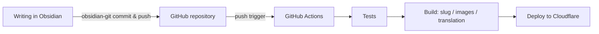

---
title: Automating Blog Updates with GitHub Actions
createdAt: 2026-08-13T00:00:00.000Z
published: true
updatedAt: 2026-08-13T00:00:00.000Z
description: Finish a post in Obsidian and hit commit once. Tests, slug generation, image processing, multilingual translation, and deployment all happen on their own.
tags:
  - Automation
  - obsidian
  - actions
slug: 20260813-01
---

Publishing a post takes me exactly one action: finish writing in Obsidian and click commit once. A few minutes later the article appears on the site, complete with an auto-generated URL, responsive images, and translations in English, Japanese, and Traditional Chinese. There are no manual steps in between — I don't even need to open a terminal.

The setup is not complicated. This post explains how it works and how to configure it.

## How It Works

There is only one core decision: open the Obsidian vault directly inside the blog repository's content directory. In my repository, `src/content/` is the vault itself, so creating a note in Obsidian is the same thing as creating a Markdown file in the repository.

That one decision turns the whole chain into a single git pipeline:



Each of the three roles owns one segment. Obsidian only writes, git only transports, CI only builds and deploys. Images don't travel through git (more on that below), so the repository contains nothing but text and the history stays light forever.

The writing side never needs to understand any detail of the build side. That is the part of this setup I am happiest with: while writing, I am just typing in an ordinary Obsidian vault.

## Obsidian Setup

Two community plugins are needed.

The first is obsidian-git. It provides commit and push inside Obsidian and can be set to auto-commit on a timer; my habit is to click once manually after finishing, which keeps the commit messages cleaner. Once it is installed, "sync" and "publish" become the same action.

The second is obsidian-image-auto-upload-plugin, used together with an image host. When I paste an image into a post, it uploads the image straight to my R2 bucket, and what lands in the Markdown is an online URL. No image binary ever appears in the repository, and the build pipeline later generates multi-width AVIF/WebP versions from that URL automatically — nothing to worry about while writing.

For the `.obsidian` directory I only commit the theme and basic settings; the plugin binaries are in `.gitignore`, since third-party code has no business being in the repository.

The frontmatter follows one fixed template:

```yaml
---
title: Post title
description: One-sentence description
createdAt: 2026-08-02
published: false
tags:
  - tag
---
```

Two design choices make writing nearly thought-free:

The file name can be anything, Chinese included — it plays no part in the URL. The URL comes from the `slug` in the frontmatter, and drafts don't need a slug at all. The first time a post flips to `published: true`, the build pipeline generates a number like `20260802-01` from the creation date and writes it back into the frontmatter, auto-incrementing when several posts share a day. Once generated it never changes; renaming the title or the file never affects the URL.

Drafts with `published: false` can be pushed to the repository without worry: the build filters them out and they never appear online. Half-written things get committed as backups anytime, with zero anxiety.

## GitHub Actions Setup

The workflow is a single file, shown here in full:

```yaml
name: Deploy Astro SSR Worker

on:
  push:
    branches:
      - master
  workflow_dispatch:

jobs:
  deploy:
    runs-on: ubuntu-latest
    permissions:
      contents: read
      deployments: write
    name: Build & Deploy
    steps:
      - name: Checkout repository
        uses: actions/checkout@v4

      - name: Setup Node.js
        uses: actions/setup-node@v4
        with:
          node-version: 24
          cache: 'npm'

      - name: Install dependencies
        run: npm ci

      - name: Run tests
        run: npm test

      - name: Build and deploy
        run: npm run deploy
        env:
          CLOUDFLARE_API_TOKEN: ${{ secrets.CLOUDFLARE_API_TOKEN }}
          CLOUDFLARE_ACCOUNT_ID: ${{ secrets.CLOUDFLARE_ACCOUNT_ID }}
          OPENAI_BASE_URL: ${{ secrets.OPENAI_BASE_URL }}
          API_KEY: ${{ secrets.API_KEY }}
          MODEL: ${{ secrets.MODEL }}
          PUBLIC_BUILD_ID: ${{ github.sha }}
```

Secrets are configured in the repository settings. `CLOUDFLARE_API_TOKEN` should be a custom token granting only the Workers, D1, and R2 permissions that deployment needs — do not use the Global API Key. The last three are credentials for the translation service; skip them if you don't need multiple languages.

`npm test` stands guard in front of deployment. If content encoding, frontmatter format, or route structure is broken, the push fails right at the test step and bad content never reaches production.

The real pipeline hides inside `npm run deploy`, which expands into these steps:

1. Content preparation: generate slugs for newly published posts and write them back into the frontmatter; sync the content IDs used by engagement data.
2. Image sync: scan post bodies for new image-host URLs, generate multi-width AVIF/WebP versions, upload them back to R2, and record them in a manifest. Already-processed images are skipped.
3. Incremental translation: translate the Chinese content into English, Japanese, and Traditional Chinese. Every post has a fingerprint cache, so unchanged posts cost zero API calls — a typical build only translates the newly written one.
4. Astro build, producing the static assets and the SSR Worker.
5. `wrangler deploy` to Cloudflare.

From push to live takes about three minutes, most of it spent on translation and the build. When the translation service is occasionally unavailable the build fails; just rerun the workflow — the cache makes reruns cheap.

## Closing

The biggest change this pipeline brought is that writing and publishing are fully decoupled. "Publishing a post" used to be a project: handle the images, think up a URL, deploy, verify. Now it is just one commit. The cost of publishing dropped to nearly nothing, and I ended up writing more often.

If you want to copy this setup, trim it to your needs: no multilingual requirement, drop the translation step and half the pipeline is gone; few images, local files with git LFS are perfectly acceptable; for a purely static site with no dynamic features at all, replace `npm run deploy` with any static host's deploy command and everything still holds. The core is one sentence: make the repository the single source of truth, and let CI do all the repetitive work.