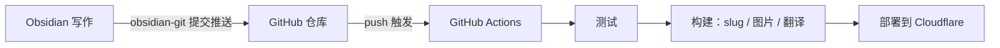

---
title: Automating Blog Updates with GitHub Actions
createdAt: 2026-08-13T00:00:00.000Z
published: true
updatedAt: 2026-08-13T00:00:00.000Z
description: Write an article in Obsidian and press commit once. Testing, slug generation, image processing, multilingual translation, and deployment are all handled automatically.
tags:
  - automation
  - obsidian
  - actions
slug: 20260813-01
---

Publishing an article involves just one action: I finish writing it in Obsidian and press commit. A few minutes later, the article appears on the website with an automatically generated URL, responsive images, and English, Japanese, and Traditional Chinese translations. There are no manual steps in between—I don't even need to open a terminal.

This workflow isn't complicated to set up. This article explains how it works and how to configure it.

## How It Works

The core decision is simple: open Obsidian's vault directly in the content directory of the blog repository. In my repository, `src/content/` is the vault itself, so creating a new note in Obsidian is equivalent to creating a new Markdown file in the repository.

This decision turns the entire process into a git pipeline:



The three components each handle one part. Obsidian is only responsible for writing, git is only responsible for transport, and CI is only responsible for building and deploying. Images don't go through git (more on that later), so the repository contains only text and its history stays lightweight forever.

The writing side doesn't need to understand any of the build-side details. This is what I like most about the whole process: when I'm writing, I'm simply typing in an ordinary Obsidian vault.

## Obsidian Configuration

Two plugins are required.

The first is obsidian-git. It provides commit and push functionality within Obsidian.

The second is obsidian-image-auto-upload-plugin, used together with the PicGo image hosting service. When I paste an image into an article, it uploads the image directly to my R2, leaving an online URL in the Markdown. No image binaries ever appear in the repository. The build process later uses that URL to automatically generate AVIF/WebP versions at multiple widths, so there's nothing to worry about while writing.

I only commit the theme and basic configuration from the `.obsidian` directory. The plugin itself is included in `.gitignore`; there's no need to put third-party code in the repository.

I use a fixed frontmatter template:

```yaml
---
title: 文章标题
description: 一句话描述
createdAt: 2026-08-02
published: false
tags:
  - 标签
---
```

Two design choices mean I hardly need to think while writing:

The filename can be anything, including Chinese, because it isn't used in the URL. The URL comes from the `slug` in the frontmatter, and drafts don't need a slug at all. When an article is changed to `published: true` for the first time, the build process automatically generates an identifier such as `20260802-01` based on the creation date and writes it back to the frontmatter. Multiple articles on the same day are incremented automatically. Once generated, it never changes; editing the title or filename has no effect on the URL.

Drafts with `published: false` can safely be pushed to the repository. They are filtered out during the build and will never appear online. I can commit unfinished work at any time as a backup, without any psychological burden.

## GitHub Repository Actions Configuration

There is only one workflow file. Its complete contents are as follows:

```yaml
name: Deploy Astro SSR Worker

on:
  push:
    branches:
      - master
  workflow_dispatch:

jobs:
  deploy:
    runs-on: ubuntu-latest
    permissions:
      contents: read
      deployments: write
    name: Build & Deploy
    steps:
      - name: Checkout repository
        uses: actions/checkout@v4

      - name: Setup Node.js
        uses: actions/setup-node@v4
        with:
          node-version: 24
          cache: 'npm'

      - name: Install dependencies
        run: npm ci

      - name: Run tests
        run: npm test

      - name: Build and deploy
        run: npm run deploy
        env:
          CLOUDFLARE_API_TOKEN: ${{ secrets.CLOUDFLARE_API_TOKEN }}
          CLOUDFLARE_ACCOUNT_ID: ${{ secrets.CLOUDFLARE_ACCOUNT_ID }}
          OPENAI_BASE_URL: ${{ secrets.OPENAI_BASE_URL }}
          API_KEY: ${{ secrets.API_KEY }}
          MODEL: ${{ secrets.MODEL }}
          PUBLIC_BUILD_ID: ${{ github.sha }}
```

Configure the secrets in the repository settings. Use a custom token for `CLOUDFLARE_API_TOKEN`, granting only the Workers, D1, and R2 permissions required for deployment—do not use the Global API Key. The last three are credentials for the translation service; if you don't need multilingual support, you can leave them unconfigured.

`npm test` acts as a gate before deployment. If there are problems with content encoding, frontmatter formatting, or the route structure, the push will fail at the testing stage and the bad content won't reach production.

The actual pipeline is hidden inside `npm run deploy`. Expanded, it consists of these steps:

1. Content preparation: Generate slugs for newly published articles and write them back to the frontmatter, while synchronizing the content IDs used for interaction data.
2. Image synchronization: Scan the body for new image-hosting URLs, generate AVIF/WebP versions at multiple widths, upload them back to R2, and write them to the manifest. Images that have already been processed are skipped.
3. Incremental translation: Translate Chinese content into English, Japanese, and Traditional Chinese. Each article has a fingerprint cache, so unchanged articles make zero API calls; during a normal build, only the newly written article is translated.
4. Astro build, producing static assets and an SSR Worker.
5. Deploy to Cloudflare with `wrangler deploy`.

It takes about three minutes from push to going live, with translation and building accounting for most of the time. If the translation service is occasionally unavailable and the build fails, just rerun the workflow. The cache makes the cost of a retry very small.

## Finally

The biggest change after using this workflow is that writing and publishing have become completely decoupled. In the past, publishing an article was a whole task involving image processing, coming up with a URL, deployment, and checking the result. Now it is simply one commit. The cost of publishing has become negligible, and I actually write more frequently as a result.

If you want to adopt this workflow, tailor it to your needs: if you don't need multilingual support, remove the translation step; if you don't have many images, using local images with git LFS is also perfectly acceptable; for a purely static site with no dynamic features at all, replace `npm run deploy` with the deployment command for any static hosting provider. The core idea can be summed up in one sentence: make the repository the single source of truth and let CI handle all the repetitive work.