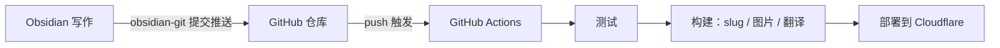

---
title: Automating Blog Updates with GitHub Actions
createdAt: 2026-08-13T00:00:00.000Z
published: true
updatedAt: 2026-08-13T00:00:00.000Z
description: Write an article in Obsidian and make a single commit. Testing, slug generation, image processing, multilingual translation, and deployment are all handled automatically.
tags:
  - automation
  - obsidian
  - actions
slug: 20260813-01
---

All I do to publish an article is finish writing it in Obsidian and click Commit once. A few minutes later, the article appears on the site with an automatically generated URL, responsive images, and translations in English, Japanese, and Traditional Chinese. There are no manual steps in between; I don't even need to open a terminal.

Setting up this workflow isn't complicated. This article explains how it works and how to configure it.

## How It Works

The whole setup hinges on one decision: open Obsidian's vault directly in the content directory of the blog repository. In my repository, `src/content/` is the vault itself; creating a new note in Obsidian is equivalent to creating a Markdown file in the repository.

This turns the entire workflow into a Git pipeline:



The three components each handle one part. Obsidian only handles writing, Git only handles transport, and CI only handles building and deploying. Images bypass Git, as I'll explain later, so the repository contains only text and its history stays lightweight forever.

The writing side doesn't need to know anything about the build side. That's what I like most about the whole workflow: when I'm writing, I'm simply writing in an ordinary Obsidian vault.

## Obsidian Setup

Two plugins are required.

The first is obsidian-git. It adds commit and push functionality to Obsidian.

The second is obsidian-image-auto-upload-plugin, used with PicGo for image hosting. When I paste an image into an article, it uploads the image directly to my R2, leaving an online URL in the Markdown. The repository never contains image binaries; later, the build process automatically generates AVIF/WebP variants at multiple widths from this URL, so I don't need to worry about it while writing.

I only commit the theme and basic configuration in the `.obsidian` directory. The plugins themselves are added to `.gitignore`, since there is no need to put third-party code in the repository.

The frontmatter uses a fixed template:

```yaml
---
title: 文章标题
description: 一句话描述
createdAt: 2026-08-02
published: false
tags:
  - 标签
---
```

Two design choices mean I barely have to think while writing:

The filename can be anything, including Chinese characters; it doesn't affect the URL. The URL comes from `slug` in the frontmatter, and drafts don't need a slug at all. When an article is first set to `published: true`, the build process automatically generates an identifier such as `20260802-01` based on the creation date and writes it back into the frontmatter. Multiple articles on the same day are automatically numbered sequentially. Once generated, it never changes; changing the title or filename has no effect on the URL.

Drafts with `published: false` can safely be pushed to the repository. They are filtered out during the build and will never appear on the live site. I can commit work in progress whenever I want for safekeeping, without a second thought.

## GitHub Repository Actions Configuration

The workflow consists of a single file, shown in full below:

```yaml
name: Deploy Astro SSR Worker

on:
  push:
    branches:
      - master
  workflow_dispatch:

jobs:
  deploy:
    runs-on: ubuntu-latest
    permissions:
      contents: read
      deployments: write
    name: Build & Deploy
    steps:
      - name: Checkout repository
        uses: actions/checkout@v4

      - name: Setup Node.js
        uses: actions/setup-node@v4
        with:
          node-version: 24
          cache: 'npm'

      - name: Install dependencies
        run: npm ci

      - name: Run tests
        run: npm test

      - name: Build and deploy
        run: npm run deploy
        env:
          CLOUDFLARE_API_TOKEN: ${{ secrets.CLOUDFLARE_API_TOKEN }}
          CLOUDFLARE_ACCOUNT_ID: ${{ secrets.CLOUDFLARE_ACCOUNT_ID }}
          OPENAI_BASE_URL: ${{ secrets.OPENAI_BASE_URL }}
          API_KEY: ${{ secrets.API_KEY }}
          MODEL: ${{ secrets.MODEL }}
          PUBLIC_BUILD_ID: ${{ github.sha }}
```

Configure the secrets in the repository settings. Use a custom token for `CLOUDFLARE_API_TOKEN`, granting it only the Workers, D1, and R2 permissions required for deployment. Do not use the Global API Key. The last three are credentials for the translation service; if you don't need multilingual support, you can leave them unset.

`npm test` acts as a gate before deployment. If there are problems with content encoding, frontmatter format, or route structure, the push will fail during this test step, and bad content cannot reach production.

The real pipeline is hidden inside `npm run deploy`; expanded, it consists of these steps:

1. Content preparation: generate slugs for newly published articles and write them back into the frontmatter; synchronize the content IDs used for interaction data.
2. Image synchronization: scan the body for new image-hosting URLs, generate AVIF/WebP variants at multiple widths, upload them back to R2, and write the results to the manifest. Images that have already been processed are skipped.
3. Incremental translation: translate Chinese content into English, Japanese, and Traditional Chinese. A fingerprint cache is maintained for each article, so unchanged articles make zero API calls; a normal build only translates the one that was just written.
4. Run the Astro build, producing static assets and an SSR Worker.
5. Deploy to Cloudflare with `wrangler deploy`.

From push to going live takes about three minutes, with translation and the build taking most of the time. If the translation service is occasionally unavailable, the build will fail. Just rerun the workflow; the cache makes reruns inexpensive.

## Finally

After using this workflow, the biggest change is that writing and publishing have become completely decoupled. Previously, publishing an article was a task in itself: handling images, figuring out a URL, deploying, and checking the result. Now it's just one commit; publishing costs so little that I can ignore it, and I actually write more often as a result.

If you want to replicate this workflow, trim it to suit your needs: if you don't need multilingual support, remove the translation step; if you don't have many images, using local images with Git LFS is also fine; for a purely static site with no dynamic features, replacing `npm run deploy` with the deployment command for any static host works just as well. The core idea is simple: make the repository the single source of truth and let CI handle all the repetitive work.