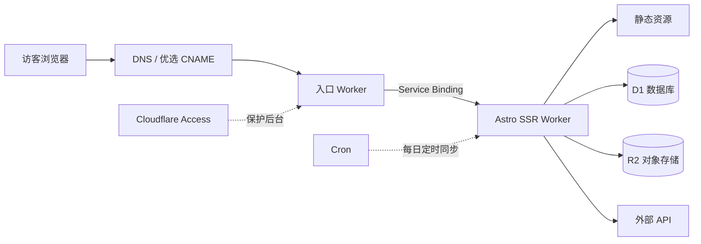
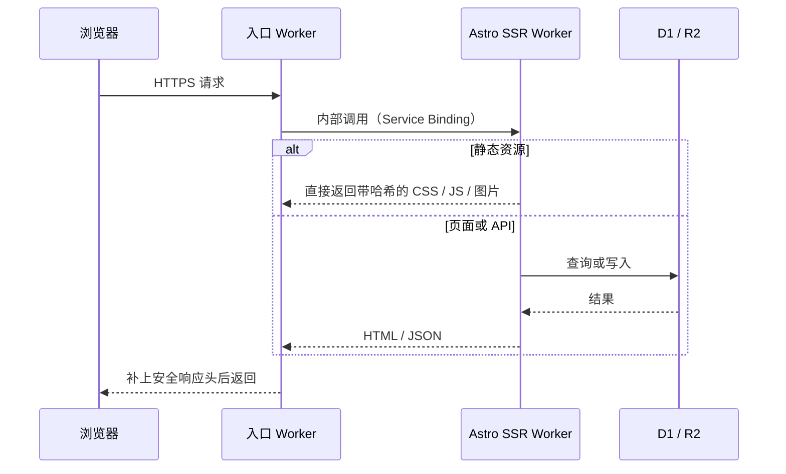

---
title: Building a Personal Website with Cloudflare
description: "An overview of this site's architecture: two Workers, one SQL database, and one object storage service"
createdAt: 2026-08-13T00:00:00.000Z
updatedAt: 2026-08-13T00:00:00.000Z
published: true
tags:
  - Networking
  - Website Building
  - Optimization
slug: 20260813-02
---

The site you're looking at now appears to be a blog, but in reality it runs on two Cloudflare Workers, one SQL database, and one object storage service. Comments, likes, and view counts update in real time; the book, music, and film collection has its own admin panel, and music rankings sync automatically every day at midnight. Aside from the domain, everything else costs essentially nothing.

This article breaks down its structure: where requests enter, where data lives, and how images are handled.

## A Single Request's Path

Here's one detail with the greatest impact on cost: requests that hit static assets neither execute code nor count toward the Workers request allowance. CSS, JS, fonts, and local images all fall into this category; they're free and unlimited. The only requests that actually consume the 100,000 free requests per day are HTML rendering and API calls that require code execution.

So my principle is to keep as many requests as possible at the static layer. Only paths such as `/api/*` and `/admin/*`, which must be handled dynamically, are configured to go through the Worker first.

## Two-Worker Design

The purpose of the entry Worker is not performance, but decoupling. My public domain uses a China-optimized entry point, and I may switch to a different solution for this path in the future; the application Worker, meanwhile, is deployed almost every day. Forwarding uses Service Binding—an internal call between Workers—without going through a public URL. As a result, the application Worker doesn't need to expose any address that could be used to bypass the entry point and access it directly.

If your site doesn't need to fuss with the entry path, you can omit this layer entirely.

## Database

D1 is Cloudflare's managed SQLite database, storing all of the site's structured data: comments, likes, view counts, metadata for the book, music, and film collection, and so on.

Before using D1, I had never paid attention to one metric: rows read. D1's free allowance is 5 million rows per day, but it counts rows scanned, not rows returned. A query that returns 20 comments can count tens of thousands of rows if it scans the entire table instead of using an index. Adding indexes to commonly filtered fields and paginating lists are optimizations that help you get the most out of D1's free allowance.

R2 stores all images: illustrations in articles and collection covers. The main reason I chose it is that egress traffic is free—bandwidth charges are the bane of image hosting. R2 stores only the files; the metadata for those files lives in D1, and the two are linked by object key.
## Image Pipeline

I write articles in Obsidian. The moment I paste an image, the image-hosting plugin uploads it directly to R2, leaving a URL in the Markdown. There are no image binary files anywhere in the repository, so the Git history never bloats.

At build time, the script generates multiple AVIF and WebP variants at several widths for each image the first time it appears (640 / 1280 / 1920), uploads them to the same directory in R2, and records the mapping in a manifest. When rendered, the URL in the Markdown remains unchanged, but the resulting HTML contains a complete `<picture>` element: the browser selects the smallest file sufficient for the viewport and pixel density, the first image in the article loads at high priority, and the rest are lazy-loaded. The original image URL always remains valid as a fallback.
## A Note on Free-Tier Limits

The zero-cost claim needs a qualification: excluding the domain, the bill is approximately zero when traffic and data volume remain within the free allowances. The exact allowances are (official figures checked in July 2026):

| Item           | Free allowance               |
| ------------ | ------------------ |
| Dynamic Worker requests | 100,000/day, shared across the account       |
| Static asset requests       | Free, unlimited             |
| D1           | 5 million row reads/day, 100,000 row writes/day |
| R2           | 10 GB of storage, free egress traffic    |

Two points are easy to misunderstand: 100,000 is the entire account-wide daily free limit, not 100,000 per Worker; and, most importantly, D1 counts scanned rows, so unindexed queries can burn through the allowance faster than you might expect.

## Accelerating Access from Mainland China

Cloudflare's default entry point is Anycast, with routing determined by BGP, which isn't always friendly to China's three major carriers. For the same site, China Telecom may be fast, while China Mobile may take a circuitous route and drop packets during evening rush hour.

My approach is an optimized CNAME: I point the domain's CNAME to a target domain that continuously measures performance and updates its DNS resolution. To be clear about what this does: it only improves the first leg—"which Cloudflare entry point the browser connects to." The TLS certificate is still mine, Host is still my domain, and the content is never decrypted by a third party. It is not a mainland CDN, an ICP-filing node, or a guarantee that every region will be faster at every hour. Third-party services can fail at any time, so I keep a fallback that lets me switch back to the default DNS within one minute.

Once traffic enters the site, speed depends on layered caching; the rules are based on how frequently each type of content changes:

- CSS / JS / fonts with content hashes: cache for one year, `immutable`. When a file changes, so does its URL, so an old file is never served.
- HTML: `no-cache`; it can be stored, but must be revalidated every time, ensuring that after a deployment users won't be left with an old page referencing resources that have already disappeared.
- Dynamic APIs such as comments and statistics: cache at the edge for 15 seconds; write requests always use `no-store`.
- GitHub heatmap: cache for 6 hours; WakaTime: cache for 15 minutes. TTL follows the actual frequency of data changes.

Finally, there's the layer that affects perceived performance. The homepage is an SPA with five horizontal pages: the current page is rendered directly, adjacent pages are prefetched when the browser is idle, and hovering over a navigation item immediately prefetches the corresponding page. The initial loading overlay waits for only two things: the page to finish painting two frames and the first above-the-fold image to finish decoding. It doesn't wait for `window.load`, because lazy-loaded images and analytics requests can delay it.

## In Brief

If your site is a purely static blog, Astro plus static asset hosting is enough; you don't need a Worker at all. Architecture should grow with requirements, not with the length of an article.

If you need comments, an admin panel, and scheduled jobs, D1 plus an SSR Worker is the lowest-maintenance combination I've used in personal projects. Remember to keep an eye on row reads.

## References

- [Workers Platform Limits](https://developers.cloudflare.com/workers/platform/limits/)
- [Static Asset Billing Rules](https://developers.cloudflare.com/workers/static-assets/billing-and-limitations/)
- [Service Bindings](https://developers.cloudflare.com/workers/runtime-apis/bindings/service-bindings/)
- [D1 Pricing](https://developers.cloudflare.com/d1/platform/pricing/)
- [R2 Pricing](https://developers.cloudflare.com/r2/pricing/)
- [MDN: Cache-Control](https://developer.mozilla.org/docs/Web/HTTP/Reference/Headers/Cache-Control)