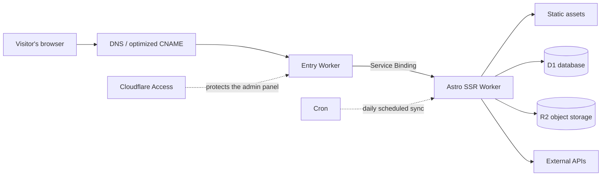
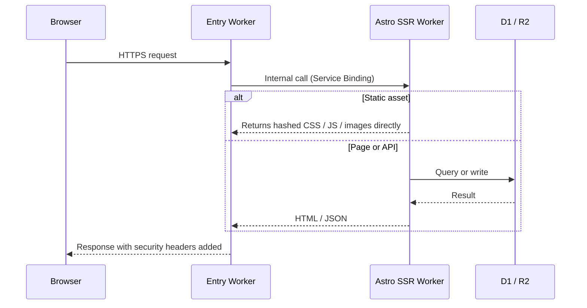

---
title: Building a Personal Website on Cloudflare
description: Two Workers, one SQL database, one object store. The complete structure of this site, and why it costs almost nothing beyond the domain name.
createdAt: 2026-08-13T00:00:00.000Z
updatedAt: 2026-08-13T00:00:00.000Z
published: true
tags:
  - Web
  - Site Building
  - Optimization
slug: 20260813-02
---

The site you are looking at appears to be a blog, but under the hood it runs two Cloudflare Workers, a SQL database, and an object store. Comments, likes, and view counts are live; the books, music, and film collections have their own admin panel; the listening chart syncs automatically in the small hours every day. And apart from the domain name, the bill is effectively zero.

This post explains how it is put together: where requests come in, where the data lives, how images are handled, and why access from mainland China stays reasonably fast. It is not a build tutorial — think of it as a guided map. If you also want to build on Cloudflare, at the end I will point out which parts are worth copying and which are not.

## The Big Picture

Each part's job fits in one sentence. The entry Worker catches all traffic on the public domain; the Astro SSR Worker is the actual application, rendering pages and handling the API; D1 stores all structured data; R2 stores all images; Access blocks the `/admin/` panel at Cloudflare's edge; Cron triggers a data sync once a day.

There is no server in the traditional sense anywhere on this site. No fixed IP, no system to patch, no process that dies in the middle of the night and needs a restart.

## What Happens on a Request

Here is the single detail with the biggest impact on cost: requests that hit static assets execute no code and do not count against the Workers request quota. CSS, JS, fonts, and local images all fall into this category — they are free and unlimited. The only things consuming the 100,000 free requests per day are HTML rendering and API calls, the requests that actually run code.

So my principle is to let as many requests as possible stop at the static layer. Only paths that must be handled dynamically, like `/api/*` and `/admin/*`, are configured to go through the Worker first.

## Why Two Workers

The entry Worker is very thin — under a hundred lines in total. It checks that the request's Host is my domain, rejects obvious cross-site write requests, forwards to the application Worker, and finally adds security response headers such as HSTS.

It exists for decoupling, not performance. My public domain goes through an optimized entry route for mainland China (more on that later), and that link may be replaced with another approach someday; the application Worker, meanwhile, gets deployed almost every day. With the two split apart, changing either side never touches the other. Forwarding uses a Service Binding — an internal call between Workers that never goes through a public URL and costs nothing extra — which also means the application Worker exposes no address that could be reached by bypassing the entry.

If your site does not need a custom entry route, you can skip this layer entirely.

## Where the Data Lives

D1 is Cloudflare's managed SQLite, and it holds all of this site's structured data: comments, likes, view counts, the metadata of the book, music, and film collections, game records, and listening charts.

Before D1 I had never paid attention to one metric: rows read. The free tier allows five million rows per day, but it counts rows scanned, not rows returned. A query that returns 20 comments may be counted as tens of thousands of rows if it scans the whole table instead of using an index. Indexing frequently filtered columns and paginating lists — the same old textbook advice — directly determines how much quota you have left on D1.

R2 stores all images: article illustrations and collection covers. The decisive reason for choosing it is free egress; bandwidth fees are what an image host fears most. R2 stores only the files; metadata such as where a file came from and what owns it lives in D1, with the two sides linked by object key.

Cron fires once a day at 4 a.m. Beijing time: first it renews the NetEase Cloud Music login cookie, then fetches the weekly and all-time charts and writes them into D1. If any step fails, the previous successful result is kept, so the music page never goes blank because one sync failed.

## The Image Pipeline

I write my posts in Obsidian. The moment I paste an image, the image-hosting plugin uploads it straight to R2, and what lands in the Markdown is an online URL. No image binary ever enters the repository, so the git history never bloats.

At build time, a script generates AVIF and WebP versions at several widths (640 / 1280 / 1920) for every image appearing for the first time, uploads them back to the same R2 directory, and writes the mapping into a manifest. The URL in the Markdown never changes, but the rendered HTML is a full `<picture>` element: the browser picks the smallest sufficient file for its viewport and pixel density, the first image above the fold loads with high priority, and the rest lazy-load. The original URL stays valid forever as the fallback.

One detail that made me laugh and cry: AVIF files are stored in R2 under keys ending in `.avif.webp`, while the returned MIME type is still `image/avif`. Something along the image host's domain wrongly blocks the `.avif` suffix, and changing the extension to route around it was easier than debugging that chain.

## The Real Limits of the Free Tier

"Zero cost" needs qualifiers: beyond the domain name, and while traffic and data stay within the free tier, the bill is effectively zero. The exact numbers (official figures checked in July 2026):

| Item | Free tier | How I use it |
| --- | --- | --- |
| Workers dynamic requests | 100k/day, shared across the account | Static assets don't count; only SSR and the API consume it |
| Static asset requests | Free, unlimited | Most requests stop at this layer |
| D1 | 5M rows read/day, 100k rows written/day | Indexes + pagination, no full-table scans |
| R2 | 10 GB storage, free egress | Image host and cover library, nowhere near full |

Two things that are easy to misunderstand: the 100k requests are a daily cap for the whole account, not 100k per Worker; and D1 counts scanned rows, so an unindexed query eats through the quota faster than you would expect.

My strategy compresses into one sentence: keep static requests out of the script, make scripted requests scan fewer rows, and finish image processing at build time.

## Access from Mainland China

Cloudflare's default entry is Anycast, with routing decided by BGP, and it is not always friendly to the three major Chinese carriers. The same site can be fast on China Telecom while taking a lossy detour on China Mobile during the evening peak.

My approach is an optimized CNAME: pointing my domain's CNAME at a target domain that keeps measuring speeds and updating its resolution results. To be clear about what it is: it only improves the first leg — which Cloudflare entry point the browser connects to. The TLS certificate is still mine, the Host is still my domain, and the content is never decrypted by any third party. It is not a Chinese CDN, not an ICP-filed node, and it does not guarantee better speed in every region at every hour. A third-party service can fail at any time, so I keep a fallback plan that switches back to default DNS within a minute.

Once inside the site, speed relies on layered caching, with rules set by how often the content changes:

- CSS / JS / fonts with content hashes: cached for a year, `immutable`. When a file changes its URL changes, so a stale file can never be served.
- HTML: `no-cache` — it may be stored but must be revalidated every time, ensuring that after a deployment no old page keeps referencing assets that no longer exist.
- Dynamic APIs like comments and stats: 15 seconds of edge caching; write requests are always `no-store`.
- The GitHub heatmap is cached for 6 hours, WakaTime for 15 minutes. TTLs follow how often the data actually changes.

Finally, the perceptual layer. The home page is a SPA of five horizontal pages: the current page is rendered directly, adjacent pages are prefetched when the browser is idle, and hovering over a nav item immediately prefetches the corresponding page. The first-load overlay waits for exactly two things — the page finishing two frames of paint and the first above-the-fold image finishing decode. It does not wait for `window.load`, because that gets dragged out by lazy-loaded images and analytics requests.

## What's Worth Copying

If your site is a purely static blog, Astro plus static asset hosting is enough — you don't need a single Worker. Architecture should grow with your needs, not with blog posts.

If you need comments, an admin panel, and scheduled tasks, D1 plus an SSR Worker is the lowest-maintenance combination I have used in a personal project. Remember to watch rows read.

If access speed from mainland China bothers you, spend one evening measuring per carrier first, then decide whether to adopt an optimized entry. Either way, keep the fallback path ready.

## References

- [Workers platform limits](https://developers.cloudflare.com/workers/platform/limits/)
- [Static assets billing](https://developers.cloudflare.com/workers/static-assets/billing-and-limitations/)
- [Service Bindings](https://developers.cloudflare.com/workers/runtime-apis/bindings/service-bindings/)
- [D1 pricing](https://developers.cloudflare.com/d1/platform/pricing/)
- [R2 pricing](https://developers.cloudflare.com/r2/pricing/)
- [MDN: Cache-Control](https://developer.mozilla.org/docs/Web/HTTP/Reference/Headers/Cache-Control)