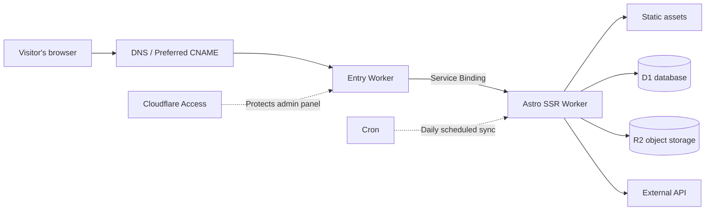
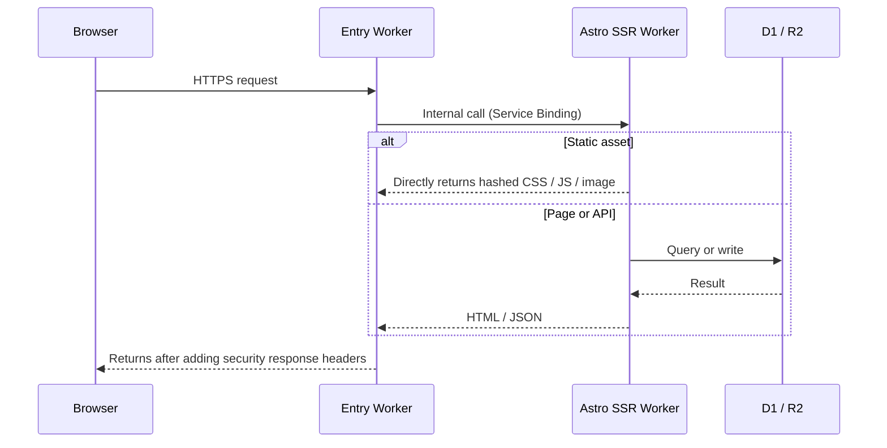

---
title: Building a Personal Website on Cloudflare
description: "An overview of this site's architecture: two Workers, one SQL database, and one object store"
createdAt: 2026-08-13T00:00:00.000Z
updatedAt: 2026-08-13T00:00:00.000Z
published: true
tags:
  - Networking
  - Site Building
  - Optimization
slug: 20260813-02
---

The site you're looking at now appears to be a blog, but it actually runs on two Cloudflare Workers, one SQL database, and one object store. Comments, likes, and page views are real-time; the collection of books, music, and films has its own admin panel; and listening rankings are synced automatically every day at midnight. Aside from the domain, the rest of the bill costs approximately zero.

This article explains its architecture: where requests enter, where data is stored, and how images are processed.

## A Single Request's Path

There is one detail here with the greatest impact on cost: requests for static assets do not execute code or count toward the Workers request quota. CSS, JS, fonts, and local images all fall into this category; they are free and unlimited. The only requests that consume the daily free quota of 100,000 are HTML rendering and API calls that require code to run.

So my principle is to keep as many requests as possible at the static layer. Only paths such as `/api/*` and `/admin/*`, which must be handled dynamically, are configured to pass through the Worker first.

## Two-Worker Design

The entry Worker exists for decoupling, not performance. My public domain uses a preferred domestic entry point, and that route may be replaced with another solution in the future; the application Worker, meanwhile, is deployed almost every day. Forwarding uses Service Bindings—in other words, internal calls between Workers that do not pass through a public URL. As a result, the application Worker does not need to expose any address that could be used to bypass the entry point for direct access.

If your site does not need to tinker with the entry route, you can omit this layer entirely.

## Database

D1 is Cloudflare's managed SQLite database, storing all the structured data for this site: comments, likes, page views, metadata for the book, music, and film collection, and so on.

Before using D1, I had never paid attention to one metric: rows read. D1's free quota is 5 million rows per day, but it is calculated based on the number of rows scanned, not the number returned. A query that returns 20 comments may scan the entire table and count tens of thousands of rows if it does not use an index. Creating indexes for frequently filtered fields and paginating lists are optimizations that make the greatest possible use of D1's free quota.

R2 stores all images: illustrations in the body of articles and collection cover images. The main reason for choosing it is that outbound traffic is free—traffic fees are what image hosting is most vulnerable to. R2 stores only the files, while the metadata corresponding to those files is kept in D1; the two are linked through object keys.
## Image Pipeline

I write articles in Obsidian. The moment I paste an image, the image-hosting plugin uploads it directly to R2, leaving an online URL in the Markdown. There are no binary image files in the repository at any point, so the Git history never grows bloated.

During the build, a script generates multiple width variants of AVIF and WebP for each image the first time it appears (640 / 1280 / 1920), uploads them back to the same directory in R2, and writes the mappings to the manifest. When rendered, the URL in the Markdown remains unchanged, but the resulting HTML contains a complete `<picture>`: the browser chooses the smallest file that is sufficient for the viewport and pixel density; the first image in the article is loaded with high priority, while the rest are lazy-loaded. The original image URL always remains valid as a fallback.
## Pay Attention to Free Quota Limits

The claim of zero cost needs one qualification: aside from the domain, the bill is approximately zero as long as traffic and data volume remain within the free quotas. The specific quotas are the official figures checked in July 2026:

| Item           | Free quota               |
| ------------ | ------------------ |
| Workers dynamic requests | 100,000 per day, shared across the account       |
| Static asset requests       | Free, unlimited             |
| D1           | 5 million rows read/day, 100,000 rows written/day |
| R2           | 10 GB storage, free outbound traffic    |

There are two points that are easy to misunderstand: 100,000 requests is the free daily limit for the entire account, not 100,000 for each Worker; and, especially, D1 counts scanned rows, so queries without indexes can consume the quota faster than you might imagine.

## Accelerating Access from Mainland China

Cloudflare's default entry point is Anycast, with routing determined by BGP, which is not always friendly to China's three major carriers. For the same site, China Telecom may be fast, while China Mobile may take a detour and lose packets during the evening peak.

My approach is to use a preferred CNAME: point the domain's CNAME to a target domain that continuously measures speeds and updates the DNS resolution results. To be clear about what this is: it only improves the first segment of the route—“which Cloudflare entry point the browser connects to.” The TLS certificate is still mine, the Host is still my domain, and the content does not pass through any third party for decryption. It is not a mainland CDN, not a registered node, and does not guarantee faster speeds in every region at every time. Third-party services may fail at any time, so I keep a fallback plan that can switch back to the default DNS within one minute.

After a request enters the site, speed depends on layered caching, with rules determined by how often the content changes:

- CSS / JS / fonts with content hashes: cached for one year with `immutable`. When a file changes, its URL changes, so an old file will never be read.
- HTML: `no-cache`; it can be stored, but must be revalidated each time, ensuring that after deployment it will not retain an old page referencing resources that have already disappeared.
- Dynamic APIs such as comments and statistics: cached at the edge for 15 seconds; write requests always use `no-store`.
- The GitHub heatmap is cached for 6 hours, and WakaTime is cached for 15 minutes. TTL follows the actual frequency at which the data changes.

Finally, there is the perceived-performance layer. The homepage is an SPA made up of five horizontal pages: the current page is rendered directly, adjacent pages are prefetched when the browser is idle, and hovering over a navigation item immediately prefetches the corresponding page. The overlay shown during the initial load waits for only two things: the page to complete two frames of rendering and the first image in the viewport to finish decoding. It does not wait for `window.load`, because the latter can be held up by lazy-loaded images and analytics requests.

## Keep It Simple

If your site is a purely static blog, Astro plus static asset hosting is enough; you do not need a Worker at all. The architecture should grow with the requirements, not with the article.

If you need comments, an admin panel, and scheduled tasks, D1 plus an SSR Worker is the lowest-maintenance combination I have used in personal projects. Remember to watch the number of rows read.

## References

- [Workers platform limits](https://developers.cloudflare.com/workers/platform/limits/)
- [Static asset billing rules](https://developers.cloudflare.com/workers/static-assets/billing-and-limitations/)
- [Service Bindings](https://developers.cloudflare.com/workers/runtime-apis/bindings/service-bindings/)
- [D1 pricing](https://developers.cloudflare.com/d1/platform/pricing/)
- [R2 pricing](https://developers.cloudflare.com/r2/pricing/)
- [MDN: Cache-Control](https://developer.mozilla.org/docs/Web/HTTP/Reference/Headers/Cache-Control)