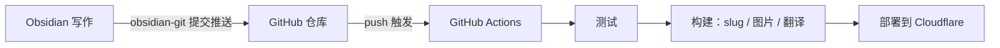

---
title: GitHub Actionsを使ったブログの自動更新
createdAt: 2026-08-13T00:00:00.000Z
published: true
updatedAt: 2026-08-13T00:00:00.000Z
description: Obsidianで記事を書き終えたら、1回コミットするだけ。テスト、slug生成、画像処理、多言語翻訳、デプロイまで、残りはすべて自動で完了します。
tags:
  - 自動化
  - obsidian
  - actions
slug: 20260813-01
---

私が記事を公開するために行う操作は、Obsidianで書き終えたら1回コミットするだけです。数分後には、URLが自動生成され、レスポンシブ画像と英語・日本語・繁体字の3つの翻訳版が付いた状態で、記事がサイトに表示されます。途中に手動の作業は一切なく、ターミナルを開く必要すらありません。

この仕組みを構築するのは難しくありません。この記事では、その原理と設定方法を説明します。

## 原理

核心となる決断は1つだけです。Obsidianの保管庫を、ブログリポジトリのコンテンツディレクトリに直接置くことです。私のリポジトリでは、`src/content/` 自体がvaultになっています。Obsidianでノートを1つ新規作成すると、リポジトリ内にMarkdownファイルを1つ新規作成することになります。

この決断によって、全体の流れは1本のgit経路になります。



3つの役割が、それぞれの区間を担当します。Obsidianは書くことだけ、gitは運ぶことだけ、CIはビルドとデプロイだけを担当します。画像はgitを経由しないため（後述します）、リポジトリにあるのはテキストだけで、履歴も常に軽量です。

執筆側で、ビルド側の細かい仕組みを理解する必要はありません。これが、この一連の流れで私が最も気に入っている点です。記事を書いているとき、私はただ普通のObsidianの保管庫で文章を書いているだけなのです。

## Obsidianの設定

必要なプラグインは2つです。

1つ目はobsidian-gitです。Obsidian上でコミットとプッシュを行えるようにします。

2つ目はobsidian-image-auto-upload-pluginで、画像ホスティングサービスのPicGoと組み合わせて使います。記事に画像を貼り付けると、画像を直接私のR2にアップロードし、MarkdownにはオンラインURLが残ります。リポジトリには最初から最後まで画像のバイナリが現れません。後続のビルド処理では、このURLをもとにAVIF/WebPの複数幅バージョンが自動生成されるため、執筆時に気にする必要はありません。

`.obsidian` ディレクトリについては、テーマと基本設定だけをコミットしています。プラグイン本体は `.gitignore` に追加してあり、サードパーティーのコードまでリポジトリに入れる必要はありません。

frontmatterには固定テンプレートを使います。

```yaml
---
title: 文章标题
description: 一句话描述
createdAt: 2026-08-02
published: false
tags:
  - 标签
---
```

執筆時にほとんど考えなくて済むように、2つの設計を採用しています。

ファイル名は自由で、中国語でも構いません。URLには使われません。URLはfrontmatterの `slug` から生成されるため、下書きではslugを書く必要すらありません。記事が初めて `published: true` に変更されたとき、ビルド処理が作成日に基づいて `20260802-01` のような番号を自動生成し、frontmatterに書き戻します。同じ日に複数の記事がある場合は自動的に連番になります。いったん生成された番号は二度と変わらないため、タイトルやファイル名を変更してもURLには影響しません。

`published: false` の下書きは、安心してリポジトリにプッシュできます。ビルド時にフィルタリングされるため、オンラインに公開されることは決してありません。書きかけの内容も、いつでもコミットしてバックアップできます。心理的な負担はありません。

## GitHubリポジトリのActions設定

ワークフローは1つのファイルだけです。完全な内容は次のとおりです。

```yaml
name: Deploy Astro SSR Worker

on:
  push:
    branches:
      - master
  workflow_dispatch:

jobs:
  deploy:
    runs-on: ubuntu-latest
    permissions:
      contents: read
      deployments: write
    name: Build & Deploy
    steps:
      - name: Checkout repository
        uses: actions/checkout@v4

      - name: Setup Node.js
        uses: actions/setup-node@v4
        with:
          node-version: 24
          cache: 'npm'

      - name: Install dependencies
        run: npm ci

      - name: Run tests
        run: npm test

      - name: Build and deploy
        run: npm run deploy
        env:
          CLOUDFLARE_API_TOKEN: ${{ secrets.CLOUDFLARE_API_TOKEN }}
          CLOUDFLARE_ACCOUNT_ID: ${{ secrets.CLOUDFLARE_ACCOUNT_ID }}
          OPENAI_BASE_URL: ${{ secrets.OPENAI_BASE_URL }}
          API_KEY: ${{ secrets.API_KEY }}
          MODEL: ${{ secrets.MODEL }}
          PUBLIC_BUILD_ID: ${{ github.sha }}
```

Secretsはリポジトリの設定で登録します。`CLOUDFLARE_API_TOKEN` にはカスタムTokenを使い、デプロイに必要なWorkers、D1、R2の権限だけを付与してください。Global API Keyは使わないでください。後ろの3つは翻訳サービスの認証情報なので、多言語対応が不要なら設定する必要はありません。

`npm test` はデプロイの前に実行されます。コンテンツのエンコーディング、frontmatterの形式、ルート構造に問題がある場合、pushはテストの段階で直接失敗します。不正なコンテンツが本番環境に到達することはありません。

本当のPipelineは `npm run deploy` の中に隠れています。展開すると、次の手順になります。

1. コンテンツの準備：新しく公開された記事のslugを生成してfrontmatterに書き戻し、インタラクションデータで使うコンテンツIDを同期する。
2. 画像の同期：本文内にある新しい画像ホスティングサービスのURLをスキャンし、AVIF/WebPの複数幅バージョンを生成してR2にアップロードし、manifestに書き込む。処理済みの画像はスキップする。
3. 差分翻訳：中国語のコンテンツを英語、日本語、繁体字に翻訳する。各記事にはフィンガープリントのキャッシュがあり、変更されていない記事ではAPIを一切呼び出さない。通常は1回のビルドで、新しく書いた記事だけを翻訳する。
4. Astroをビルドし、静的アセットとSSR Workerを出力する。
5. `wrangler deploy` でCloudflareにデプロイする。

pushしてから公開されるまで、およそ3分です。時間の大半は翻訳とビルドにかかります。翻訳サービスが一時的に利用できずビルドに失敗した場合は、workflowをもう一度実行すれば大丈夫です。キャッシュがあるため、再実行のコストは小さく済みます。

## 最後に

この仕組みを使って最も大きく変わったのは、執筆と公開が完全に切り離されたことです。以前は、記事を公開するには画像の処理、URLの検討、デプロイ、確認まで必要でした。今では、ただ1回コミットするだけです。公開にかかるコストが無視できるほど小さくなり、むしろ書く頻度が上がりました。

この仕組みをそのまま使いたい場合は、必要に応じて削ってください。多言語対応が不要なら翻訳のステップを削除します。画像が少なく、ローカル画像をgit LFSで管理しても問題ないなら、それでも構いません。動的機能のない完全な静的サイトなら、`npm run deploy` を任意の静的ホスティングサービスのデプロイコマンドに置き換えれば成立します。核心は一言で言えば、リポジトリを唯一の信頼できる情報源にし、CIにすべての繰り返し作業を任せることです。