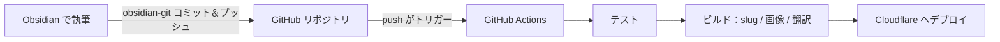

---
title: GitHub Actions でブログ更新を自動化する
createdAt: 2026-08-13T00:00:00.000Z
published: true
updatedAt: 2026-08-13T00:00:00.000Z
description: Obsidian で記事を書き終えたら、コミットを1回押すだけ。テスト、slug 生成、画像処理、多言語翻訳、デプロイまで、残りはすべて自動で完了する。
tags:
  - 自動化
  - obsidian
  - actions
slug: 20260813-01
---

私が記事を1本公開するためにする操作は、Obsidian で書き終えてコミットを1回クリックする、これだけです。数分後には記事がサイトに現れます。自動生成された URL、レスポンシブ画像、そして英語・日本語・繁体字の3つの翻訳版付きで。途中に手作業は一切なく、ターミナルを開く必要すらありません。

この仕組みを組むのは難しくありません。この記事でその原理と設定をはっきり説明します。

## 原理

核心となる決定はひとつだけです。Obsidian の保管庫（vault）をブログリポジトリのコンテンツディレクトリの中に直接開くこと。私のリポジトリでは `src/content/` が vault そのものであり、Obsidian でノートを新規作成することは、リポジトリに Markdown ファイルを新規作成することと同じです。

この決定によって、チェーン全体が1本の git パイプラインになります。



3つの役割がそれぞれ1区間ずつを受け持ちます。Obsidian は書くことだけ、git は運ぶことだけ、CI はビルドとデプロイだけ。画像は git を通らないので（後述）、リポジトリにあるのはテキストだけで、履歴は永遠に軽いままです。

執筆側はビルド側の詳細を一切理解する必要がありません。この仕組みで私が一番気に入っているのはここです。記事を書いているとき、私はただ普通の Obsidian 保管庫で文字を打っているだけなのです。

## Obsidian の設定

コミュニティプラグインが2つ必要です。

1つ目は obsidian-git。Obsidian 内でコミットとプッシュができ、定時の自動コミットも設定できます。私の習慣は書き終えたら手動で1回クリックすることで、コミットメッセージがきれいに保てます。導入してしまえば、「同期」と「公開」は同じ操作になります。

2つ目は obsidian-image-auto-upload-plugin で、画像ホスティングと組み合わせて使います。記事に画像を貼り付けると、画像を直接私の R2 バケットにアップロードし、Markdown に残るのはオンライン URL です。リポジトリには最初から最後まで画像バイナリが現れず、ビルドプロセスが後からこの URL を基に AVIF/WebP の複数幅バージョンを自動生成するので、執筆時に気にすることはありません。

`.obsidian` ディレクトリはテーマと基本設定だけをコミットし、プラグイン本体は `.gitignore` に入れました。サードパーティのコードをリポジトリに入れる必要はありません。

frontmatter は固定テンプレートを1つ使います。

```yaml
---
title: 記事タイトル
description: 一文の説明
createdAt: 2026-08-02
published: false
tags:
  - タグ
---
```

2つの設計のおかげで、執筆時にほとんど何も考えずに済みます。

ファイル名は自由で、中国語でも構いません。URL には関与しないからです。URL は frontmatter の `slug` から生まれますが、下書きに slug を書く必要はまったくありません。記事が初めて `published: true` になったとき、ビルドプロセスが作成日から `20260802-01` のような番号を自動生成して frontmatter に書き戻します。同じ日に複数あれば自動で連番になります。一度生成されたら二度と変わらず、タイトルやファイル名を変えても URL には影響しません。

`published: false` の下書きは安心してリポジトリにプッシュできます。ビルド時にフィルタリングされ、公開サイトに現れることは決してありません。書きかけのものをいつでもコミットしてバックアップでき、心理的な負担がありません。

## GitHub リポジトリの Actions 設定

ワークフローはファイル1つだけです。全文は以下のとおり。

```yaml
name: Deploy Astro SSR Worker

on:
  push:
    branches:
      - master
  workflow_dispatch:

jobs:
  deploy:
    runs-on: ubuntu-latest
    permissions:
      contents: read
      deployments: write
    name: Build & Deploy
    steps:
      - name: Checkout repository
        uses: actions/checkout@v4

      - name: Setup Node.js
        uses: actions/setup-node@v4
        with:
          node-version: 22.12.0
          cache: 'npm'

      - name: Install dependencies
        run: npm ci

      - name: Run tests
        run: npm test

      - name: Build and deploy
        run: npm run deploy
        env:
          CLOUDFLARE_API_TOKEN: ${{ secrets.CLOUDFLARE_API_TOKEN }}
          CLOUDFLARE_ACCOUNT_ID: ${{ secrets.CLOUDFLARE_ACCOUNT_ID }}
          OPENAI_BASE_URL: ${{ secrets.OPENAI_BASE_URL }}
          API_KEY: ${{ secrets.API_KEY }}
          MODEL: ${{ secrets.MODEL }}
          PUBLIC_BUILD_ID: ${{ github.sha }}
```

Secrets はリポジトリ設定で構成します。`CLOUDFLARE_API_TOKEN` にはカスタムトークンを使い、デプロイに必要な Workers・D1・R2 の権限だけを付与してください。Global API Key は使わないこと。最後の3つは翻訳サービスの認証情報で、多言語が不要なら設定しなくて構いません。

`npm test` がデプロイの手前で門番をします。コンテンツのエンコーディング、frontmatter の形式、ルーティング構造に問題があれば、push はテストの段階で失敗し、壊れたコンテンツが本番に届くことはありません。

本当のパイプラインは `npm run deploy` の中に隠れています。展開すると次のステップです。

1. コンテンツ準備：新しく公開される記事に slug を生成して frontmatter に書き戻し、エンゲージメントデータ用のコンテンツ ID を同期する。
2. 画像同期：本文中の新しい画像 URL をスキャンし、AVIF/WebP の複数幅バージョンを生成して R2 に戻し、manifest に記録する。処理済みの画像はスキップ。
3. 増分翻訳：中国語のコンテンツを英語・日本語・繁体字に翻訳する。記事ごとにフィンガープリントのキャッシュがあり、変更のない記事は API 呼び出しゼロ。日常のビルドで翻訳されるのは新しく書いた1本だけ。
4. Astro ビルド。静的アセットと SSR Worker を出力する。
5. `wrangler deploy` で Cloudflare にデプロイ。

push から公開まではおよそ3分で、大半は翻訳とビルドに費やされます。翻訳サービスがたまに使えないときはビルドが失敗しますが、ワークフローを再実行すればいいだけです。キャッシュのおかげで再実行のコストはごくわずかです。

## 最後に

このパイプラインを使って一番変わったのは、執筆と公開が完全に分離されたことです。以前は「記事を公開する」がひとつの仕事でした。画像を処理し、URL を考え、デプロイし、確認する。いまではただの1回のコミットです。公開のコストが無視できるほど下がり、書く頻度はかえって上がりました。

この仕組みを真似したいなら、必要に応じて削ってください。多言語が要らなければ翻訳ステップを外す。それだけでパイプラインは半分になります。画像が少なければ、ローカル画像と git LFS でも十分です。動的機能すらない純粋な静的サイトなら、`npm run deploy` を任意の静的ホスティングのデプロイコマンドに置き換えても成立します。核心は一文です。リポジトリを唯一の真実の源にして、繰り返し作業はすべて CI にやらせること。