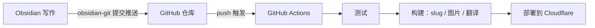

---
title: GitHub Actionsを使ったブログ更新の自動化
createdAt: 2026-08-13T00:00:00.000Z
published: true
updatedAt: 2026-08-13T00:00:00.000Z
description: Obsidianで記事を書き終えたら、コミットを1回するだけ。テスト、slugの生成、画像処理、多言語翻訳、デプロイまで、残りはすべて自動で完了します。
tags:
  - 自動化
  - obsidian
  - actions
slug: 20260813-01
---

私が記事を1本公開するために行う操作は、Obsidianで書き終えたら、一度コミットするだけです。数分後には、記事が自動生成されたURL、レスポンシブ画像、英語・日本語・繁体字中国語の3つの翻訳版を伴ってサイトに表示されます。途中で手動の作業は一切なく、ターミナルを開く必要すらありません。

この仕組みを構築するのは難しくありません。この記事では、その原理と設定を詳しく説明します。

## 仕組み

核心となる決断は、Obsidianの保管庫をブログリポジトリのコンテンツディレクトリに直接置くことです。私のリポジトリでは、`src/content/` 自体が保管庫であり、Obsidianでノートを1つ新規作成することは、リポジトリ内にMarkdownファイルを1つ新規作成することと同じです。

この決定によって、一連の流れ全体が1本のgit経路になりました。



3つの役割がそれぞれ担当する範囲を分けます。Obsidianは執筆だけ、gitは運搬だけ、CIはビルドとデプロイだけを担当します。画像はgitを経由しません（後述します）ので、リポジトリにはテキストしかなく、履歴は常に軽量です。

執筆側でビルド側の細部を理解する必要はありません。これがこの一連の仕組みで私が最も気に入っている点です。記事を書いているときは、ただ普通のObsidianの保管庫で文章を書いているだけなのです。

## Obsidianの設定

必要なのは2つのプラグインです。

1つ目はobsidian-gitです。Obsidianにコミットとプッシュの機能を追加します。

2つ目はobsidian-image-auto-upload-pluginで、画像アップロード用のPicGoと組み合わせて使います。記事に画像を貼り付けると、画像が私のR2に直接アップロードされ、MarkdownにはオンラインURLが書き込まれます。リポジトリには最初から最後まで画像のバイナリが現れません。後続のビルドフローでは、このURLを基にAVIF/WebPの複数幅バージョンを自動生成してR2に送り返すため、執筆時に気にする必要はありません。

`.obsidian` ディレクトリではテーマと基本設定だけをコミットし、プラグイン本体は `.gitignore` に追加しています。サードパーティーのコードまでリポジトリに入れる必要はありません。

frontmatterには固定テンプレートを使います。

```yaml
---
title: 文章标题
description: 一句话描述
createdAt: 2026-08-02
published: false
tags:
  - 标签
---
```

この2つの設計により、執筆時にはほとんど何も考えずに済みます。

ファイル名は自由に付けられ、中国語でも構いません。URLには使われません。URLはfrontmatterの `slug` から決まり、下書きではそもそもslugを書く必要がありません。記事を初めて `published: true` に変更すると、ビルドフローが作成日に基づいて `20260802-01` のような番号を自動生成し、frontmatterに書き戻します。同じ日に複数の記事がある場合は自動的に連番になります。番号は一度生成されると永遠に変わらず、タイトルやファイル名を変更してもURLには影響しません。

`published: false` の下書きは安心してリポジトリにpushできます。ビルド時に除外されるため、公開されることは決してありません。書きかけの記事もいつでもコミットしてバックアップでき、気兼ねがありません。

## GitHubリポジトリのActions設定

ワークフローは1つのファイルだけです。完全な内容は以下のとおりです。

```yaml
name: Deploy Astro SSR Worker

on:
  push:
    branches:
      - master
  workflow_dispatch:

jobs:
  deploy:
    runs-on: ubuntu-latest
    permissions:
      contents: read
      deployments: write
    name: Build & Deploy
    steps:
      - name: Checkout repository
        uses: actions/checkout@v4

      - name: Setup Node.js
        uses: actions/setup-node@v4
        with:
          node-version: 24
          cache: 'npm'

      - name: Install dependencies
        run: npm ci

      - name: Run tests
        run: npm test

      - name: Build and deploy
        run: npm run deploy
        env:
          CLOUDFLARE_API_TOKEN: ${{ secrets.CLOUDFLARE_API_TOKEN }}
          CLOUDFLARE_ACCOUNT_ID: ${{ secrets.CLOUDFLARE_ACCOUNT_ID }}
          OPENAI_BASE_URL: ${{ secrets.OPENAI_BASE_URL }}
          API_KEY: ${{ secrets.API_KEY }}
          MODEL: ${{ secrets.MODEL }}
          PUBLIC_BUILD_ID: ${{ github.sha }}
```

Secretsはリポジトリの設定で登録します。`CLOUDFLARE_API_TOKEN` にはカスタムトークンを使い、デプロイに必要なWorkers、D1、R2の権限だけを付与してください。Global API Keyは使わないでください。後ろの3つは翻訳サービスの認証情報なので、多言語対応が必要なければ設定する必要はありません。

`npm test` はデプロイ前の関門です。コンテンツのエンコーディング、frontmatterの形式、ルーティング構造に問題があると、pushはテストの段階で失敗し、問題のあるコンテンツが公開環境に到達することはありません。

実際のパイプラインは `npm run deploy` の中に隠れており、分解すると次の手順になります。

1. コンテンツの準備：新たに公開する記事にslugを生成してfrontmatterに書き戻し、インタラクションデータで使うコンテンツIDを同期する。
2. 画像の同期：本文内にある新しい画像ホスティングURLをスキャンし、AVIF/WebPの複数幅バージョンを生成してR2に送り返し、manifestに書き込む。すでに処理済みの画像はそのままスキップする。
3. 増分翻訳：中国語のコンテンツを英語、日本語、繁体字中国語に翻訳する。記事ごとにフィンガープリントのキャッシュがあり、変更のない記事ではAPIを一度も呼び出さない。通常の1回のビルドでは、新しく書いた記事だけを翻訳する。
4. Astroをビルドし、静的リソースとSSR Workerを出力する。
5. `wrangler deploy` でCloudflareにデプロイする。

pushから公開まで約3分で、その大半を占めるのは翻訳とビルドです。翻訳サービスがときどき利用できないとビルドが失敗しますが、ワークフローを1回再実行すれば大丈夫です。キャッシュのおかげで、再実行のコストは小さく済みます。

## 最後に

このフローを使ってみて最も大きく変わったのは、執筆と公開が完全に切り離されたことです。以前は、記事を公開するには画像を処理し、URLを考え、デプロイし、確認しなければなりませんでした。今では、それが1回のコミットだけで済みます。公開のコストが無視できるほど低くなったため、むしろ書く頻度は上がりました。

このフローを取り入れたいなら、要件に合わせて簡略化してください。多言語対応が不要なら翻訳のステップを削除し、画像が少ないならローカル画像をgit LFSで管理する方法でも問題ありません。動的機能がまったくない純粋な静的サイトなら、`npm run deploy` を任意の静的ホスティング向けデプロイコマンドに置き換えても機能します。要点は一言で言えば、リポジトリを唯一の信頼できる情報源にし、CIにすべての反復作業を任せることです。