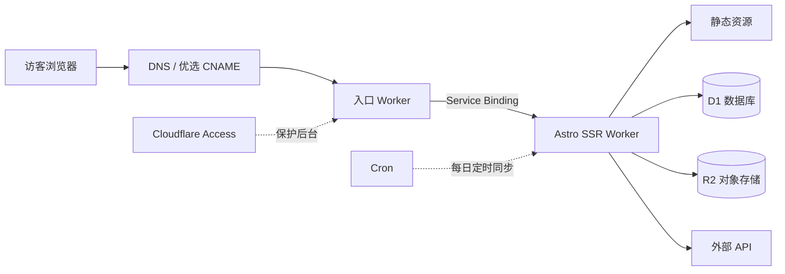
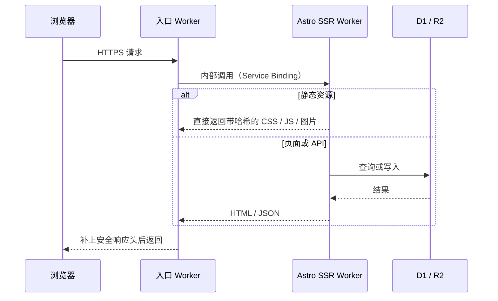

---
title: Cloudflareで個人サイトを構築する
description: このサイトの構成紹介：2つのWorker、1つのSQLデータベース、1つのオブジェクトストレージ
createdAt: 2026-08-13T00:00:00.000Z
updatedAt: 2026-08-13T00:00:00.000Z
published: true
tags:
  - ネットワーク
  - サイト構築
  - 最適化
slug: 20260813-02
---

今ご覧になっているこのサイトは、表面上はブログですが、実際には2つのCloudflare Worker、1つのSQLデータベース、1つのオブジェクトストレージ上で動いています。コメント、いいね、閲覧数はリアルタイムで更新され、書籍・音楽・映像のコレクションには専用の管理画面があり、音楽ランキングは毎日深夜に自動同期されます。請求額も、ドメイン以外の部分はほぼゼロです。

この記事では、その構成を紹介します。リクエストがどこから入り、データがどこに保存され、画像がどのように処理されるのかを説明します。

## 1つのリクエストの経路

ここでコストに最も大きく影響する細部があります。静的リソースにヒットしたリクエストではコードが実行されず、Workersのリクエスト数にもカウントされません。CSS、JS、フォント、ローカル画像はすべてこの対象で、無料かつ無制限です。1日10万回の無料枠を実際に消費するのは、コードの実行が必要なHTMLのレンダリングとAPI呼び出しだけです。

そのため、私の原則は、できるだけ多くのリクエストを静的レイヤーで止めることです。`/api/*` や `/admin/*` のように動的処理が必須のパスだけを、まずWorkerを通す構成にしています。

## 2つのWorkerによる構成

入口Workerの存在意義は、性能ではなく分離にあります。公開ドメインは中国国内向けに最適化した入口を経由しており、この経路は将来別の方式に変更する可能性があります。一方、アプリケーションWorkerはほぼ毎日デプロイしています。転送にはService Binding、つまりWorker間の内部呼び出しを使っているため、公開URLを経由しません。そのため、アプリケーションWorkerは、入口を迂回して直接アクセスされる可能性のあるアドレスを一切公開する必要もありません。

サイトの入口経路を複雑にする必要がないなら、この層は完全に省略できます。

## データベース

D1はCloudflareが提供するマネージドSQLiteで、このサイトの構造化データをすべて保存しています。コメント、いいね、閲覧数、書籍・音楽・映像コレクションのメタデータなどです。

D1を使うまで、私はある指標を意識していませんでした。それが行の読み取り数です。D1の無料枠は1日500万行ですが、カウントされるのは返却された行数ではなく、スキャンした行数です。20件のコメントを返すクエリでも、インデックスを使わずにテーブル全体をスキャンすると、数万行としてカウントされる可能性があります。よく使う絞り込み用のフィールドにインデックスを作ることや、一覧をページ分割することなどの最適化によって、D1の無料枠を最大限に活用できます。

R2にはすべての画像を保存しています。本文中の画像やコレクションのカバー画像などです。R2を選んだ主な理由は、データ転送量が無料だからです。画像ホスティングで最も怖いのは、トラフィック料金です。R2にはファイルだけを保存し、それらのファイルに対応するメタデータはD1に保存しています。両者はオブジェクトキーで関連付けています。
## 画像パイプライン

私はObsidianで記事を書いています。画像を貼り付けた瞬間に、画像ホスティング用のプラグインが画像をそのままR2へアップロードし、MarkdownにはオンラインURLが残ります。リポジトリには最初から最後まで画像のバイナリファイルが存在しないため、gitの履歴が膨らむこともありません。

ビルド時には、スクリプトが初めて登場する各画像について、AVIFとWebPの複数の幅のバージョン（640 / 1280 / 1920）を生成します。それらを同じディレクトリのR2へアップロードし、対応関係をmanifestに書き込みます。レンダリング時には、Markdown内のURLは変わりませんが、出力されるHTMLは完全な`<picture>`になります。ブラウザはビューポートとピクセル密度に応じて、必要十分な最小サイズのファイルを選択します。本文の1枚目の画像は優先度を高くして読み込み、それ以外は遅延読み込みします。元画像のURLは常に有効で、フォールバックとして機能します。
## 無料枠の制限に注意

ここでいうゼロコストには条件があります。ドメイン以外について、アクセス量とデータ量が無料枠の範囲内であれば、請求額はほぼゼロという意味です。具体的な無料枠は次のとおりです（2026年7月に確認した公式の数値）。

| 項目           | 無料枠               |
| ------------ | ------------------ |
| Workersの動的リクエスト | 1日10万回、アカウント共有       |
| 静的リソースのリクエスト       | 無料、無制限             |
| D1           | 1日500万行の読み取り、10万行の書き込み |
| R2           | 10 GBのストレージ、データ転送量無料    |

誤解されやすい点が2つあります。10万回というのは、アカウント全体に対する1日あたりの無料上限であり、Workerごとに10万回ではありません。もう1つは特に注意が必要です。D1はスキャンした行数でカウントされるため、インデックスのないクエリは想像以上の速さで無料枠を消費します。

## 中国本土からのアクセス高速化

Cloudflareのデフォルトの入口はAnycastで、ルーティングはBGPによって決まります。そのため、中国国内の3大通信事業者にとって必ずしも好ましい経路になるとは限りません。同じサイトでも、China Telecomでは速い一方、China Mobileでは混雑する時間帯に迂回やパケットロスが発生することがあります。

私が採用しているのは、最適化されたCNAMEです。ドメインを、継続的に速度を測定してDNSの解決結果を更新するターゲットドメインへCNAME設定します。これが何を意味するのかは明確にしておきます。改善されるのは「ブラウザがCloudflareのどの入口に接続するか」という最初の経路だけです。TLS証明書は私自身のもので、Hostも自分のドメインのままです。コンテンツが第三者によって復号されることもありません。これは中国国内のCDNではなく、ICP登録済みのノードでもなく、すべての地域・すべての時間帯で高速になることを保証するものでもありません。第三者サービスはいつ停止するかわからないため、1分以内にデフォルトのDNSへ戻せるフォールバック手段を用意しています。

サイトに到達した後の速度は、キャッシュを階層化して確保しています。ルールは、コンテンツがどのくらいの頻度で変わるかに応じて決めています。

- ハッシュ付きのCSS / JS / フォント：1年間キャッシュし、`immutable`を指定。ファイルが変わればURLも変わるため、古いファイルが読み込まれることはありません。
- HTML：`no-cache`。保存はできますが、毎回再検証します。デプロイ後に、すでに消えたリソースを参照する古いページが使われるのを防ぎます。
- コメントや統計などの動的API：エッジで15秒間キャッシュし、書き込みリクエストには一律`no-store`を指定します。
- GitHubのヒートマップは6時間、WakaTimeは15分間キャッシュします。TTLはデータの実際の変化頻度に合わせています。

最後は体感速度に関わる部分です。トップページは、5つの横並びページで構成されたSPAです。現在のページはサーバーから直接返し、隣接ページはブラウザがアイドル状態のときに先読みします。ナビゲーション上の項目にマウスを合わせると、対応するページをすぐに先読みします。初回読み込み時のオーバーレイが待つのは、ページの2フレームの描画完了と、ファーストビューの1枚目の画像のデコード完了の2つだけです。`window.load`は待ちません。`window.load`は遅延読み込み画像や統計リクエストによって遅くなるためです。

## 節約版

サイトが純粋な静的ブログなら、Astroと静的リソースのホスティングだけで十分です。Workerすら必要ありません。アーキテクチャは記事に合わせて大きくするのではなく、要件に合わせて成長させるべきです。

コメント、管理画面、定期タスクが必要なら、D1とSSR Workerの組み合わせが、私が使ってきた個人プロジェクトの中では最も保守コストの低い構成です。行の読み取り数を確認することを忘れないでください。

## 参考

- [Workersプラットフォームの制限](https://developers.cloudflare.com/workers/platform/limits/)
- [静的リソースの料金ルール](https://developers.cloudflare.com/workers/static-assets/billing-and-limitations/)
- [Service Bindings](https://developers.cloudflare.com/workers/runtime-apis/bindings/service-bindings/)
- [D1の料金](https://developers.cloudflare.com/d1/platform/pricing/)
- [R2の料金](https://developers.cloudflare.com/r2/pricing/)
- [MDN：Cache-Control](https://developer.mozilla.org/docs/Web/HTTP/Reference/Headers/Cache-Control)