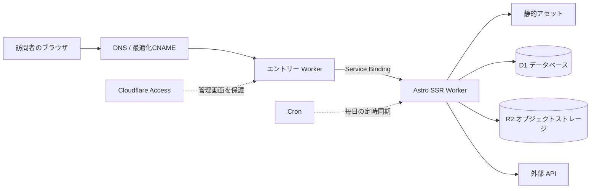
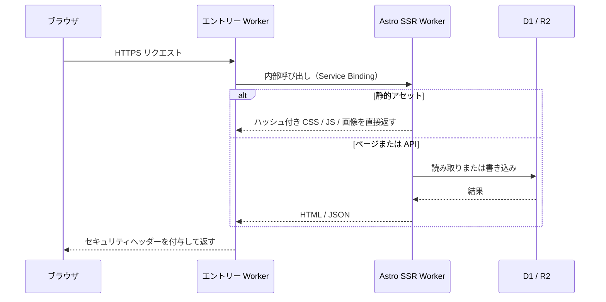

---
title: Cloudflareで個人サイトを構築する
description: Worker 2つ、SQLデータベース1つ、オブジェクトストレージ1つ。このサイトの全体構成と、ドメイン以外ほぼゼロコストで運用できる理由。
createdAt: 2026-08-13T00:00:00.000Z
updatedAt: 2026-08-13T00:00:00.000Z
published: true
tags:
  - ネットワーク
  - サイト構築
  - 最適化
slug: 20260813-02
---

いまご覧いただいているこのサイトは、見た目はブログですが、裏では Cloudflare Worker が2つ、SQL データベースが1つ、オブジェクトストレージが1つ動いています。コメント・いいね・閲覧数はリアルタイムで、本・音楽・映像のコレクションには専用の管理画面があり、リスニングランキングは毎日未明に自動同期されます。それでいて、請求書に載るのはドメイン代だけで、それ以外はほぼゼロです。

この記事ではその構成を紹介します。リクエストはどこから入ってくるのか、データはどこに置かれているのか、画像はどう処理されるのか、中国本土からのアクセスがなぜ遅くならないのか。構築チュートリアルではなく、案内図のようなものだと思ってください。あなたも Cloudflare でサイトを作りたいなら、どの部分を真似する価値があり、どの部分にないかを最後に述べます。

## 全体像

各部分の分担は一文ずつで説明できます。エントリー Worker は公開ドメインへの全トラフィックを受け止める。Astro SSR Worker が本体のアプリケーションで、ページのレンダリングと API を処理する。D1 はすべての構造化データを保存する。R2 はすべての画像を保存する。Access は `/admin/` の管理画面を Cloudflare のエッジでブロックする。Cron は1日1回データ同期をトリガーする。

このサイトには従来の意味でのサーバーが存在しません。固定 IP もなく、パッチを当てるべき OS もなく、深夜に落ちて再起動が必要になるプロセスもありません。

## 1つのリクエストで何が起きるか

ここにコストへの影響が最も大きいディテールがあります。静的アセットにヒットしたリクエストはコードを実行せず、Workers のリクエスト枠にもカウントされません。CSS、JS、フォント、ローカル画像はすべてこのカテゴリーに入り、無料かつ無制限です。1日10万回の無料枠を実際に消費するのは、コードを走らせる必要のある HTML レンダリングと API 呼び出しだけです。

だから私の原則は、できるだけ多くのリクエストを静的レイヤーで止めることです。`/api/*` や `/admin/*` のような動的処理が必須のパスだけを「先に Worker を通す」設定にしています。

## なぜ Worker が2つなのか

エントリー Worker は非常に薄く、合わせても100行足らずです。リクエストの Host が自分のドメインかを検証し、明らかなクロスサイトの書き込みリクエストを拒否し、アプリケーション Worker に転送し、最後に HSTS などのセキュリティレスポンスヘッダーをまとめて付与します。

これが存在する意味はパフォーマンスではなく、疎結合です。私の公開ドメインは中国本土向けの最適化エントリー（後述）を経由しており、この経路は将来別の方式に替わるかもしれません。一方、アプリケーション Worker はほぼ毎日デプロイされています。2つに分けておけば、どちらを変更してももう片方に触れる必要がありません。転送には Service Binding、つまり Worker 間の内部呼び出しを使っています。公開 URL を経由せず、追加料金もかからず、アプリケーション Worker はエントリーを迂回して直接アクセスされうるアドレスを一切公開せずに済みます。

エントリー経路をいじる必要がないサイトなら、この層は丸ごと省略できます。

## データはどこにあるか

D1 は Cloudflare のマネージド SQLite で、このサイトのすべての構造化データを保存しています。コメント、いいね、閲覧数、本・音楽・映像コレクションのメタデータ、ゲーム記録、リスニングランキング。

D1 を使う前は気にしたことのなかった指標があります。行読み取り数です。D1 の無料枠は1日500万行ですが、カウントされるのは返された行数ではなくスキャンされた行数です。コメントを20件返すクエリでも、インデックスを使わずテーブル全体をスキャンすれば、数万行としてカウントされるかもしれません。よく使うフィルタ列にインデックスを張る、リストをページネーションする。こうした昔ながらの定石が、D1 では残り枠に直結します。

R2 はすべての画像を保存します。本文の挿絵とコレクションのカバーです。選んだ決定的な理由は下り転送量が無料なこと。画像ホスティングが最も恐れるのは転送量課金です。R2 にはファイルだけを置き、ファイルの出所や帰属といったメタデータは D1 にあり、両者はオブジェクトキーで紐づいています。

Cron は毎日北京時間の午前4時に1回発火します。まず NetEase Cloud Music のログイン Cookie を更新し、それから週間ランキングと総合ランキングを取得して D1 に書き込みます。どのステップが失敗しても前回の成功結果が保持されるので、1回の同期失敗で音楽ページが空白になることはありません。

## 画像パイプライン

私は Obsidian で記事を書いています。画像を貼り付けた瞬間、アップローダープラグインがそれを直接 R2 に送り、Markdown に残るのはオンライン URL です。リポジトリには最初から最後まで画像のバイナリが存在せず、git の履歴が肥大化することはありません。

ビルド時にスクリプトが、初めて登場する画像ごとに AVIF と WebP を複数の幅（640 / 1280 / 1920）で生成し、R2 の同じディレクトリに戻し、マッピングを manifest に書き込みます。レンダリング時、Markdown 内の URL は変わりませんが、出力される HTML は完全な `<picture>` になります。ブラウザはビューポートとピクセル密度に応じて最小限で足りるファイルを選び、ファーストビューの1枚目は高優先度で読み込まれ、残りは遅延読み込みされます。元の URL は常に有効で、フォールバックとして機能します。

苦笑いした細部をひとつ。AVIF ファイルの R2 での保存キーは `.avif.webp` で終わり、返される MIME は依然として `image/avif` です。画像ホスティングのドメインのどこかが `.avif` 拡張子を誤ってブロックするためで、その経路を調査するより拡張子を変えて回避するほうが早かったのです。

## 無料枠の本当の境界線

「ゼロコスト」には限定が必要です。ドメインを除き、アクセス量とデータ量が無料枠に収まっている限り、請求はほぼゼロ。具体的な枠は以下のとおりです（2026年7月に確認した公式数値）。

| 項目 | 無料枠 | 私の使い方 |
| --- | --- | --- |
| Workers 動的リクエスト | 10万回/日、アカウント全体で共有 | 静的アセットは消費せず、SSR と API のみ |
| 静的アセットリクエスト | 無料・無制限 | 大半のリクエストはこの層で止まる |
| D1 | 読み取り500万行/日、書き込み10万行/日 | インデックス＋ページネーションでフルスキャン回避 |
| R2 | ストレージ10 GB、下り転送無料 | 画像とカバーの置き場。まったく使い切れない |

誤解しやすい点が2つあります。10万回はアカウント全体の1日の無料上限であり、Worker ごとに10万回ではありません。また D1 はスキャン行数でカウントするため、インデックスのないクエリは想像を超える速さで枠を食い潰します。

私の戦略を一文に圧縮すると、静的なものはスクリプトに入れない、スクリプトに入るものはスキャン行数を減らす、画像はビルド時に処理し終える、です。

## 中国本土からのアクセス

Cloudflare のデフォルトエントリーは Anycast で、ルーティングは BGP が決めます。中国の三大キャリアに対して常に友好的とは限りません。同じサイトでも、China Telecom では速く、China Mobile では夜のピーク時に遠回りしてパケットロスが起きる、ということがあります。

私のやり方は最適化 CNAME です。ドメインの CNAME を、継続的に速度を測定して解決結果を更新してくれるターゲットドメインに向けます。これが何なのかを正確に言うと、「ブラウザが Cloudflare のどのエントリーポイントに接続するか」という最初の区間だけを改善するものです。TLS 証明書は自分のもののままで、Host も自分のドメインのままで、コンテンツが第三者に復号されることはありません。中国国内の CDN ではなく、ICP 登録済みノードでもなく、すべての地域・すべての時間帯で速くなる保証もありません。第三者サービスはいつ止まってもおかしくないので、1分以内にデフォルト DNS へ戻せるフォールバック手順を残してあります。

サイトに入ったあとの速度はキャッシュの階層化に頼ります。ルールは「そのコンテンツはどのくらいで変わるか」で決めています。

- コンテンツハッシュ付きの CSS / JS / フォント：1年キャッシュ、`immutable`。ファイルが変われば URL も変わるので、古いファイルを読むことは決してない。
- HTML：`no-cache`。保存はできるが毎回再検証が必要。デプロイ後に、消えたアセットを参照する古いページを掴まされないため。
- コメントや統計などの動的 API：エッジで15秒キャッシュ。書き込みリクエストは一律 `no-store`。
- GitHub ヒートマップは6時間、WakaTime は15分キャッシュ。TTL はデータの実際の変化頻度に従う。

最後は体感の層です。ホームは5つの横並びページからなる SPA で、現在のページは直接レンダリングし、隣のページはブラウザのアイドル時にプリフェッチし、ナビゲーションにマウスが乗った瞬間に該当ページをプリフェッチします。初回読み込みのオーバーレイが待つのは2つだけ。ページが2フレーム描画を終えること、ファーストビューの1枚目の画像がデコードを終えること。`window.load` は待ちません。あれは遅延読み込みの画像や統計リクエストに引きずられるからです。

## 真似する価値があるのはどこか

あなたのサイトが純粋な静的ブログなら、Astro と静的アセットホスティングで十分で、Worker は1つも要りません。アーキテクチャは記事に合わせてではなく、必要に合わせて育てるべきです。

コメント、管理画面、定時タスクが必要なら、D1 と SSR Worker の組み合わせは、私が個人プロジェクトで使った中で最もメンテナンスコストが低いものです。行読み取り数だけは見ておいてください。

中国本土からのアクセス速度に悩んでいるなら、まず一晩かけてキャリア別に実測してから、最適化エントリーを導入するかを決めてください。導入するにせよしないにせよ、フォールバック経路は必ず残しておくこと。

## 参考

- [Workers プラットフォームの制限](https://developers.cloudflare.com/workers/platform/limits/)
- [静的アセットの課金ルール](https://developers.cloudflare.com/workers/static-assets/billing-and-limitations/)
- [Service Bindings](https://developers.cloudflare.com/workers/runtime-apis/bindings/service-bindings/)
- [D1 料金](https://developers.cloudflare.com/d1/platform/pricing/)
- [R2 料金](https://developers.cloudflare.com/r2/pricing/)
- [MDN: Cache-Control](https://developer.mozilla.org/docs/Web/HTTP/Reference/Headers/Cache-Control)