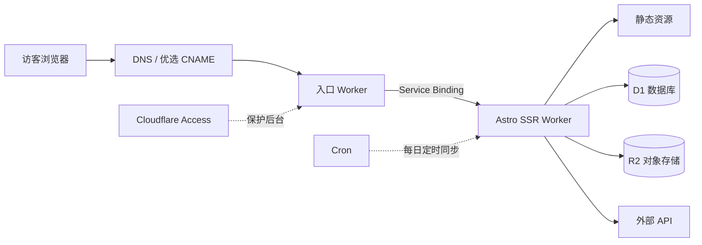
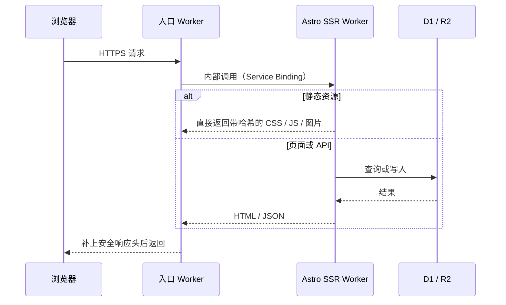

---
title: Cloudflareで個人サイトを構築する
description: このサイトの構成紹介：2つの Worker、1つの SQL データベース、1つのオブジェクトストレージ
createdAt: 2026-08-13T00:00:00.000Z
updatedAt: 2026-08-13T00:00:00.000Z
published: true
tags:
  - ネットワーク
  - サイト構築
  - 最適化
slug: 20260813-02
---

今あなたが見ているこのサイトは、表向きはブログですが、実際には2つの Cloudflare Worker、1つの SQL データベース、1つのオブジェクトストレージで動いています。コメント、いいね、閲覧数はリアルタイムで更新され、書籍・音楽・映像のコレクションには独自の管理画面があり、音楽の再生ランキングは毎日深夜に自動同期されます。請求額はドメイン代を除けば、ほぼゼロです。

この記事では、その構成を紹介します。リクエストはどこから入り、データはどこに置かれ、画像はどう処理されるのか。

## 単一リクエストの経路

ここには、コストに最も大きく影響する細部が一つあります。静的リソースに該当するリクエストはコードを実行せず、Workers のリクエスト数にもカウントされません。CSS、JS、フォント、ローカル画像はすべてこの種類に含まれ、無料かつ無制限です。1日10万回の無料枠を実際に消費するのは、コードの実行が必要な HTML のレンダリングと API 呼び出しだけです。

だから私の原則は、できるだけ多くのリクエストを静的レイヤーで止めることです。`/api/*`、`/admin/*` のように動的処理が必須のパスだけ、先に Worker を通すよう設定しています。

## 2つのWorker構成

入口 Worker が存在する理由は、性能ではなく疎結合です。私の公開ドメインは中国国内向けの最適化された入口を経由しており、この経路は将来別の方式に変更する可能性があります。一方、アプリケーション Worker はほぼ毎日デプロイしています。転送には Service Binding を使っています。つまり Worker 同士の内部呼び出しであり、公開 URL を経由しません。そのためアプリケーション Worker は、入口を迂回して直接アクセスされうるアドレスを一切公開する必要もありません。

サイトで入口経路をいじる必要がなければ、この層は完全に省けます。

## データベース

D1 は Cloudflare がホスティングする SQLite で、このサイトの構造化データをすべて保存しています。コメント、いいね、閲覧数、書籍・音楽・映像コレクションのメタデータなどです。

D1 を使うまで、私はある指標を気にしたことがありませんでした。それが行読み取り数です。D1 の無料枠は1日500万行ですが、返された行数ではなく、スキャンした行数で計算されます。20件のコメントを返すクエリでも、インデックスを使わずに全表をスキャンすれば、数万行としてカウントされる可能性があります。よく使う絞り込みフィールドにインデックスを作り、一覧をページネーションする。こうした最適化によって、D1 の無料枠を最大限に活用できます。

R2 にはすべての画像を保存しています。本文中の画像やコレクションのカバー画像などです。R2 を選んだ主な理由は、エグレス料金が無料だからです。画像置き場で最も避けたいのは、トラフィック料金です。R2 にはファイルだけを保存し、それらのファイルに対応するメタデータは D1 に置き、両者をオブジェクトキーで関連付けています。
## 画像パイプライン

私は Obsidian で記事を書いており、画像を貼り付けた瞬間に、画像ホスティング用プラグインがそれを R2 へ直接アップロードします。Markdown に残るのはオンライン URL だけです。リポジトリには画像のバイナリファイルが最初から最後まで一切なく、git の履歴も肥大化しません。

ビルド時には、スクリプトが初出の画像ごとに AVIF と WebP の複数の幅のバージョン（640 / 1280 / 1920）を生成し、R2 の同じディレクトリにアップロードするとともに、対応関係を manifest に書き込みます。レンダリング時には、Markdown 内のその URL は変わらない一方、出力される HTML は完全な `<picture>` になります。ブラウザはビューポートとピクセル密度に応じて、必要十分な最小のファイルを選びます。本文の1枚目の画像は高い優先度で読み込み、それ以外は遅延読み込みします。元画像の URL は常に有効で、フォールバックとして機能します。
## 無料枠の制限に注意

ここでいうコストゼロには条件があります。ドメイン代を除き、アクセス量とデータ量が無料枠内である場合に限って、請求額はほぼゼロです。無料枠の具体的な内容は（2026年7月に確認した公式の数値）：

| 項目           | 無料枠               |
| ------------ | ------------------ |
| Workers 動的リクエスト | 1日10万回、アカウントで共有       |
| 静的リソースリクエスト       | 無料、無制限             |
| D1           | 1日500万行の読み取り、1日10万行の書き込み |
| R2           | 10 GBのストレージ、エグレス無料    |

誤解しやすい点が2つあります。10万回というのはアカウント全体で1日に使える無料上限であり、Workerごとに10万回ではありません。特に注意したいのは、D1 はスキャンした行数で数えるということです。インデックスのないクエリは、思いもよらない速度で無料枠を食い潰します。

## 中国本土からのアクセスを高速化

Cloudflare のデフォルトの入口は Anycast で、ルーティングは BGP が決めるため、中国国内の三大通信事業者にとって常に相性がよいとは限りません。同じサイトでも、中国電信では非常に速いのに、中国移動では夕方のピーク時に迂回してパケットロスが起こることがあります。

私の方法は、優選 CNAME です。ドメインの CNAME 先を、継続的に速度測定を行い、DNS の解決結果を更新するターゲットドメインにします。これが何をするものかは明確にしておきます。これは「ブラウザが Cloudflare のどの入口に接続するか」という最初の経路だけを改善するものです。TLS 証明書は自分のもののまま、Host も自分のドメインのままで、コンテンツが第三者によって復号されることはありません。中国国内の CDN でも、ICP 登録済みのノードでもなく、すべての地域・時間帯で速くなる保証もありません。第三者サービスはいつ使えなくなるかわからないため、1分以内にデフォルト DNS へ戻せるフォールバック案を残しています。

アクセス後の速度はキャッシュを階層化して稼ぎ、ルールはコンテンツがどれくらいの頻度で変わるかに応じて決めています。

- 内容ハッシュ付きの CSS / JS / フォント：1年間キャッシュし、`immutable` にします。ファイルが変われば URL も変わるため、古いファイルを読むことは決してありません。
- HTML：`no-cache`。保存はできますが、毎回再検証します。デプロイ後に、すでに消えたリソースを参照する古いページを取得しないようにします。
- コメントや統計などの動的 API：エッジで15秒キャッシュし、書き込みリクエストは一律 `no-store`。
- GitHub のヒートマップは6時間、WakaTime は15分キャッシュします。TTL はデータの実際の更新頻度に合わせています。

最後は体感のレイヤーです。ホームページは、横方向に切り替わる5ページで構成された SPA です。現在のページは直接出力し、隣接ページはブラウザがアイドル状態のときに先読みします。ナビゲーションの項目にマウスを合わせると、対応するページをすぐに先読みします。初回ロード時のオーバーレイが待つのは2つだけです。ページの2フレームの描画完了と、ファーストビューの1枚目の画像のデコード完了です。`window.load` は待ちません。後者は遅延読み込み画像と統計リクエストに引き延ばされるためです。

## 結論

もしサイトが純粋な静的ブログなら、Astro と静的リソースのホスティングだけで十分で、Worker は1つも必要ありません。アーキテクチャは記事に合わせて大きくするのではなく、要件に合わせて成長させるべきです。

コメント、管理画面、定期タスクが必要なら、D1 と SSR Worker の組み合わせが、私が使ってきた個人プロジェクトの中では保守コストが最も低いものでした。行読み取り数を確認するのを忘れないでください。

## 参考

- [Workers プラットフォームの制限](https://developers.cloudflare.com/workers/platform/limits/)
- [静的リソースの課金ルール](https://developers.cloudflare.com/workers/static-assets/billing-and-limitations/)
- [Service Bindings](https://developers.cloudflare.com/workers/runtime-apis/bindings/service-bindings/)
- [D1 の料金](https://developers.cloudflare.com/d1/platform/pricing/)
- [R2 の料金](https://developers.cloudflare.com/r2/pricing/)
- [MDN：Cache-Control](https://developer.mozilla.org/docs/Web/HTTP/Reference/Headers/Cache-Control)