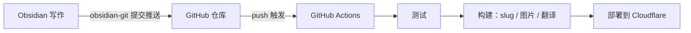

---
title: 使用 GitHub Actions 實現部落格自動化更新
createdAt: 2026-08-13T00:00:00.000Z
published: true
updatedAt: 2026-08-13T00:00:00.000Z
description: 在 Obsidian 裡寫完文章，按一次提交。測試、slug 產生、圖片處理、多語言翻譯和部署，其餘全部自動完成。
tags:
  - 自動化
  - obsidian
  - actions
slug: 20260813-01
---

我發布一篇文章的全部操作是：在 Obsidian 裡寫完，點一次提交。幾分鐘後文章出現在網站上，帶有自動產生的 URL、響應式圖片，以及英文、日文和繁體中文三個翻譯版本。過程中沒有任何手動步驟，我甚至不需要打開終端機。

這套流程建置起來並不複雜，這篇文章會說清楚它的原理和設定。

## 原理

核心只有一個決定：把 Obsidian 的 vault 直接設在部落格儲存庫的內容目錄裡。我的儲存庫裡 `src/content/` 就是 vault 本身，在 Obsidian 裡新增一篇筆記，就等於在儲存庫裡新增一個 Markdown 檔案。

這個決定讓整條鏈路變成一條 git 通道：



三個角色各自負責一段。Obsidian 只負責寫作，git 只負責傳輸，CI 只負責建置與部署。圖片不經過 git（後面會說明），所以儲存庫裡只有文字，歷史紀錄永遠輕量。

寫作端不需要理解建置端的任何細節。這是整套流程中我最滿意的一點：寫文章時，我就只是在一個普通的 Obsidian vault 裡打字。

## Obsidian 設定

需要兩個外掛。

第一個是 obsidian-git。它在 Obsidian 裡提供提交與推送功能。

第二個是 obsidian-image-auto-upload-plugin，搭配圖床 PicGo 使用。在文章裡貼上圖片時，它會直接把圖片上傳到我的 R2，Markdown 裡留下的是一個線上 URL。儲存庫從頭到尾都不會出現圖片二進位檔，後續建置流程還會根據這個 URL 自動產生 AVIF/WebP 的多寬度版本，寫作時不用理會。

`.obsidian` 目錄我只提交主題和基本設定，外掛本體已加入 `.gitignore`，第三方程式碼沒有必要放進儲存庫。

frontmatter 使用固定範本：

```yaml
---
title: 文章标题
description: 一句话描述
createdAt: 2026-08-02
published: false
tags:
  - 标签
---
```

兩個設計讓寫作時幾乎不需要思考：

檔名隨便取，中文也可以，它不參與 URL。URL 來自 frontmatter 裡的 `slug`，而草稿根本不用填寫 slug。當一篇文章第一次改為 `published: true` 時，建置流程會依建立日期自動產生像 `20260802-01` 這樣的編號，並寫回 frontmatter；同一天有多篇文章時會自動遞增。產生過一次就永遠不變，修改標題或檔名都不會影響 URL。

`published: false` 的草稿可以放心推送到儲存庫，建置時會被過濾掉，永遠不會出現在線上。寫到一半的內容隨時提交備份，完全沒有心理負擔。

## GitHub 儲存庫 Actions 設定

工作流程只有一個檔案，完整內容如下：

```yaml
name: Deploy Astro SSR Worker

on:
  push:
    branches:
      - master
  workflow_dispatch:

jobs:
  deploy:
    runs-on: ubuntu-latest
    permissions:
      contents: read
      deployments: write
    name: Build & Deploy
    steps:
      - name: Checkout repository
        uses: actions/checkout@v4

      - name: Setup Node.js
        uses: actions/setup-node@v4
        with:
          node-version: 24
          cache: 'npm'

      - name: Install dependencies
        run: npm ci

      - name: Run tests
        run: npm test

      - name: Build and deploy
        run: npm run deploy
        env:
          CLOUDFLARE_API_TOKEN: ${{ secrets.CLOUDFLARE_API_TOKEN }}
          CLOUDFLARE_ACCOUNT_ID: ${{ secrets.CLOUDFLARE_ACCOUNT_ID }}
          OPENAI_BASE_URL: ${{ secrets.OPENAI_BASE_URL }}
          API_KEY: ${{ secrets.API_KEY }}
          MODEL: ${{ secrets.MODEL }}
          PUBLIC_BUILD_ID: ${{ github.sha }}
```

Secrets 請在儲存庫設定頁面中設定。CLOUDFLARE_API_TOKEN 使用自訂 Token，只授予部署所需的 Workers、D1、R2 權限，不要使用 Global API Key；後三個是翻譯服務的憑證，沒有多語言需求就不用設定。

`npm test` 是部署前的關卡。如果內容編碼、frontmatter 格式或路由結構有問題，push 會直接在測試這一步失敗，有問題的內容無法上線。

真正的管線藏在 `npm run deploy` 裡，展開來就是以下幾步：

1. 內容準備：為新發布的文章產生 slug 並寫回 frontmatter，同步互動資料所使用的內容 ID。
2. 圖片同步：掃描正文中的新圖床 URL，產生 AVIF/WebP 多種寬度的版本並傳回 R2，寫入 manifest。已處理過的圖片會直接跳過。
3. 增量翻譯：將中文內容翻譯成英文、日文和繁體中文。每篇文章都有指紋快取，未變更的文章完全不會呼叫 API，平常一次建置只會翻譯新寫的那一篇。
4. Astro 建置，輸出靜態資源和 SSR Worker。
5. `wrangler deploy` 部署到 Cloudflare。

從 push 到上線大約三分鐘，其中大部分時間花在翻譯和建置上。翻譯服務偶爾無法使用時，建置會失敗，重新執行一次 workflow 就行；快取讓重跑的成本很低。

## 最後

這套流程用下來最大的變化是寫作和發布徹底解耦了。以前發布文章是一件事，要處理圖片、想 URL、部署、檢查；現在它只是一個提交，發布成本低到可以忽略，反而寫得更頻繁了。

如果你想照抄這套流程，就按需求裁剪：不需要多語言，就拿掉翻譯那一步；圖片不多，本機圖片搭配 git LFS 也可以接受；對於連動態功能都沒有的純靜態網站，將 `npm run deploy` 換成任何靜態託管服務的部署命令也都適用。核心就一句話：讓儲存庫成為唯一事實來源，讓 CI 完成所有重複勞動。