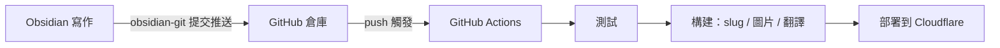

---
title: 使用 GitHub Actions 實現部落格自動化更新
createdAt: 2026-08-13T00:00:00.000Z
published: true
updatedAt: 2026-08-13T00:00:00.000Z
description: 在 Obsidian 裡寫完文章，按一次提交。測試、slug 產生、圖片處理、多語言翻譯和部署，剩下的全部自動完成。
tags:
  - 自動化
  - obsidian
  - actions
slug: 20260813-01
---

我發布一篇文章的全部操作是：在 Obsidian 裡寫完，點一次提交。幾分鐘後文章出現在網站上，帶著自動產生的 URL、響應式圖片和英文、日文、繁體三個翻譯版本。中間沒有任何手動步驟，我甚至不需要打開終端機。

這套流程搭起來不複雜，這篇文章講清楚它的原理和設定。

## 原理

核心只有一個決定：把 Obsidian 的儲存庫直接開在部落格倉庫的內容目錄裡。我的倉庫裡 `src/content/` 就是 vault 本身，Obsidian 裡新建一篇筆記，等於在倉庫裡新建了一個 Markdown 檔案。

這個決定把整條鏈路變成了一條 git 通道：



三個角色各管一段。Obsidian 只負責寫，git 只負責運輸，CI 只負責構建和部署。圖片不走 git（後面講），所以倉庫裡只有文字，歷史永遠輕量。

寫作端不需要理解構建端的任何細節。這是整套流程裡我最滿意的一點：寫文章的時候，我就只是在一個普通的 Obsidian 儲存庫裡寫字。

## Obsidian 設定

需要兩個社群外掛。

第一個是 obsidian-git。它在 Obsidian 裡提供提交和推送，可以設成定時自動提交，我的習慣是寫完手動點一次，commit 訊息乾淨些。裝好之後，「同步」和「發布」就是同一個動作。

第二個是 obsidian-image-auto-upload-plugin，配合圖床使用。往文章裡貼上圖片時，它把圖片直接上傳到我的 R2 儲存桶，Markdown 裡落下的是一個線上 URL。倉庫從頭到尾不出現圖片二進位檔，構建流程後續還會基於這個 URL 自動產生 AVIF/WebP 的多寬度版本，寫作時不用管。

`.obsidian` 目錄我只提交主題和基礎設定，外掛本體加進了 `.gitignore`，第三方程式碼沒必要進倉庫。

frontmatter 用一個固定範本：

```yaml
---
title: 文章標題
description: 一句話描述
createdAt: 2026-08-02
published: false
tags:
  - 標籤
---
```

兩個設計讓寫作時幾乎不用思考：

檔名隨便取，中文也行，它不參與 URL。URL 來自 frontmatter 裡的 `slug`，而草稿根本不用寫 slug。當一篇文章第一次改成 `published: true`，構建流程會按建立日期自動產生 `20260802-01` 這樣的編號並寫回 frontmatter，同一天多篇自動遞增。產生過一次就永遠不變，改標題、改檔名都不影響 URL。

`published: false` 的草稿可以放心推到倉庫，構建時會被過濾，永遠不會出現在線上。寫一半的東西隨時提交備份，沒有心理負擔。

## GitHub 倉庫 Actions 設定

工作流程就一個檔案，完整內容如下：

```yaml
name: Deploy Astro SSR Worker

on:
  push:
    branches:
      - master
  workflow_dispatch:

jobs:
  deploy:
    runs-on: ubuntu-latest
    permissions:
      contents: read
      deployments: write
    name: Build & Deploy
    steps:
      - name: Checkout repository
        uses: actions/checkout@v4

      - name: Setup Node.js
        uses: actions/setup-node@v4
        with:
          node-version: 24
          cache: 'npm'

      - name: Install dependencies
        run: npm ci

      - name: Run tests
        run: npm test

      - name: Build and deploy
        run: npm run deploy
        env:
          CLOUDFLARE_API_TOKEN: ${{ secrets.CLOUDFLARE_API_TOKEN }}
          CLOUDFLARE_ACCOUNT_ID: ${{ secrets.CLOUDFLARE_ACCOUNT_ID }}
          OPENAI_BASE_URL: ${{ secrets.OPENAI_BASE_URL }}
          API_KEY: ${{ secrets.API_KEY }}
          MODEL: ${{ secrets.MODEL }}
          PUBLIC_BUILD_ID: ${{ github.sha }}
```

Secrets 在倉庫設定裡配置。`CLOUDFLARE_API_TOKEN` 用自訂 Token，只授予部署需要的 Workers、D1、R2 權限，不要用 Global API Key；後三個是翻譯服務的憑證，沒有多語言需求就不用配。

`npm test` 擋在部署前面。內容編碼、frontmatter 格式、路由結構有問題，push 會直接失敗在測試這一步，壞內容到不了線上。

真正的流水線藏在 `npm run deploy` 裡，展開是這幾步：

1. 內容準備：給新發布的文章產生 slug 並寫回 frontmatter，同步互動資料用的內容 ID。
2. 圖片同步：掃描內文裡新的圖床 URL，產生 AVIF/WebP 多寬度版本傳回 R2，寫入 manifest。已處理過的圖直接跳過。
3. 增量翻譯：把中文內容翻譯成英文、日文、繁體。每篇文章有指紋快取，沒改動的文章零 API 呼叫，日常一次構建只翻新寫的那篇。
4. Astro 構建，輸出靜態資源和 SSR Worker。
5. `wrangler deploy` 部署到 Cloudflare。

從 push 到上線大約三分鐘，其中大頭是翻譯和構建。翻譯服務偶爾不可用時構建會失敗，重跑一次 workflow 就行，快取讓重跑的代價很小。

## 最後

這套流程用下來最大的變化是寫作和發布徹底解耦了。以前「發文章」是一件事，要處理圖片、想 URL、部署、檢查；現在它只是一次提交，發布成本低到可以忽略，寫的頻率反而高了。

如果你想抄這套流程，按需求裁剪：不需要多語言，去掉翻譯那步，流水線砍掉一半；圖片不多，本地圖片加 git LFS 也能接受；連動態功能都沒有的純靜態站，`npm run deploy` 換成任何靜態託管的部署指令都成立。核心就一句話：讓倉庫成為唯一事實來源，讓 CI 做所有重複勞動。