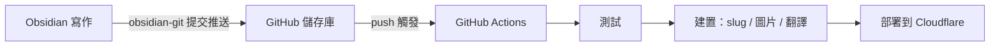

---
title: 使用 GitHub Actions 實現部落格自動化更新
createdAt: 2026-08-13T00:00:00.000Z
published: true
updatedAt: 2026-08-13T00:00:00.000Z
description: 在 Obsidian 裡寫完文章，按一次提交。測試、slug 生成、圖片處理、多語言翻譯和部署，剩下的全部自動完成。
tags:
  - 自動化
  - obsidian
  - actions
slug: 20260813-01
---

我發布一篇文章的全部操作是：在 Obsidian 裡寫完，點一次提交。幾分鐘後文章出現在網站上，帶著自動生成的 URL、響應式圖片和英文、日文、繁體三個翻譯版本。中間沒有任何手動步驟，我甚至不需要打開終端機。

這套流程搭建起來並不複雜，這篇文章會講清楚它的原理和設定。

## 原理

核心只有一個決定：把 Obsidian 的庫直接開在部落格儲存庫的內容目錄裡。我的儲存庫裡 `src/content/` 就是 vault 本身，Obsidian 裡新建一篇筆記，就等於在儲存庫裡新建了一個 Markdown 檔案。

這個決定把整條鏈路變成了一條 git 通道：



三個角色各自負責一段。Obsidian 只負責寫作，git 只負責運輸，CI 只負責建置和部署。圖片不經過 git（後面會說明），所以儲存庫裡只有文字，歷史紀錄永遠保持輕量。

寫作端不需要理解建置端的任何細節。這是整套流程裡我最滿意的一點：寫文章的時候，我就只是在一個普通的 Obsidian 庫裡打字。

## Obsidian 設定

需要兩個外掛。

第一個是 obsidian-git。它在 Obsidian 裡提供提交和推送功能。

第二個是 obsidian-image-auto-upload-plugin，搭配圖床 PicGo 使用。往文章裡貼上圖片時，它會直接把圖片上傳到我的 R2，Markdown 裡留下的是一個線上 URL。儲存庫從頭到尾都不會出現圖片二進位檔，後續建置流程還會基於這個 URL 自動生成 AVIF/WebP 的多種寬度版本，寫作時完全不用操心。

`.obsidian` 目錄我只提交主題和基礎設定，外掛本體則加入了 `.gitignore`，第三方程式碼沒有必要放進儲存庫。

frontmatter 使用一個固定範本：

```yaml
---
title: 文章标题
description: 一句话描述
createdAt: 2026-08-02
published: false
tags:
  - 标签
---
```

兩個設計讓寫作時幾乎不用思考：

檔名隨便取，中文也可以，它不會參與 URL。URL 來自 frontmatter 裡的 `slug`，而草稿根本不用寫 slug。當一篇文章第一次改成 `published: true` 時，建置流程會依照建立日期自動生成 `20260802-01` 這樣的編號並寫回 frontmatter，同一天有多篇文章時會自動遞增。生成過一次後就永遠不變，修改標題、修改檔名都不會影響 URL。

`published: false` 的草稿可以放心推送到儲存庫，建置時會被過濾，永遠不會出現在線上。寫到一半的內容隨時提交備份，不必有心理負擔。

## GitHub 儲存庫 Actions 設定

工作流程只有一個檔案，完整內容如下：

```yaml
name: Deploy Astro SSR Worker

on:
  push:
    branches:
      - master
  workflow_dispatch:

jobs:
  deploy:
    runs-on: ubuntu-latest
    permissions:
      contents: read
      deployments: write
    name: Build & Deploy
    steps:
      - name: Checkout repository
        uses: actions/checkout@v4

      - name: Setup Node.js
        uses: actions/setup-node@v4
        with:
          node-version: 24
          cache: 'npm'

      - name: Install dependencies
        run: npm ci

      - name: Run tests
        run: npm test

      - name: Build and deploy
        run: npm run deploy
        env:
          CLOUDFLARE_API_TOKEN: ${{ secrets.CLOUDFLARE_API_TOKEN }}
          CLOUDFLARE_ACCOUNT_ID: ${{ secrets.CLOUDFLARE_ACCOUNT_ID }}
          OPENAI_BASE_URL: ${{ secrets.OPENAI_BASE_URL }}
          API_KEY: ${{ secrets.API_KEY }}
          MODEL: ${{ secrets.MODEL }}
          PUBLIC_BUILD_ID: ${{ github.sha }}
```

Secrets 在儲存庫設定中配置。`CLOUDFLARE_API_TOKEN` 使用自訂 Token，只授予部署所需的 Workers、D1、R2 權限，不要使用 Global API Key；後三個是翻譯服務的憑證，沒有多語言需求就不用設定。

`npm test` 會擋在部署前面。內容編碼、frontmatter 格式或路由結構有問題時，push 會直接在測試這一步失敗，錯誤內容無法上線。

真正的 Pipeline 藏在 `npm run deploy` 裡，展開來就是以下幾步：

1. 內容準備：為新發布的文章生成 slug 並寫回 frontmatter，同步互動資料使用的內容 ID。
2. 圖片同步：掃描正文裡新的圖床 URL，生成 AVIF/WebP 多種寬度的版本並傳回 R2，寫入 manifest。已處理過的圖片會直接跳過。
3. 增量翻譯：把中文內容翻譯成英文、日文、繁體。每篇文章都有指紋快取，沒有變動的文章不會產生任何 API 呼叫，日常一次建置只會翻譯新寫的那篇。
4. Astro 建置，輸出靜態資源和 SSR Worker。
5. 使用 `wrangler deploy` 部署到 Cloudflare。

從 push 到上線大約三分鐘，其中大部分時間花在翻譯和建置上。翻譯服務偶爾無法使用時，建置會失敗，重新執行一次 workflow 就可以了，快取也讓重跑的代價很小。

## 最後

這套流程使用下來最大的變化，就是寫作和發布徹底解耦了。以前發布文章是一件事，要處理圖片、想 URL、部署、檢查；現在它只是一個提交，發布成本低到可以忽略，寫作頻率反而提高了。

如果你想照搬這套流程，可以依照需求裁剪：不需要多語言，就移除翻譯那一步；圖片不多，本地圖片搭配 git LFS 也可以接受；如果是連動態功能都沒有的純靜態網站，把 `npm run deploy` 換成任何靜態託管服務的部署命令都行得通。核心就一句話：讓儲存庫成為唯一事實來源，讓 CI 負責所有重複性工作。