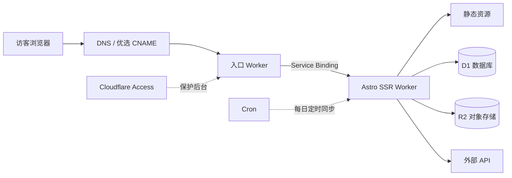
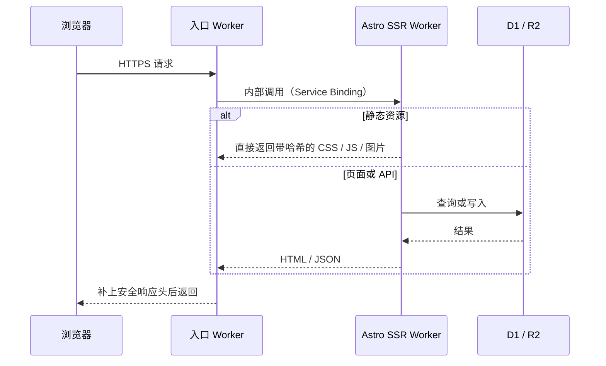

---
title: 基於 Cloudflare 建置個人網站
description: 本站架構介紹：兩個 Worker、一個 SQL 資料庫、一個物件儲存
createdAt: 2026-08-13T00:00:00.000Z
updatedAt: 2026-08-13T00:00:00.000Z
published: true
tags:
  - 網路
  - 網站架設
  - 最佳化
slug: 20260813-02
---

你現在看到的這個網站，表面上是個部落格，實際上運行著兩個 Cloudflare Worker、一個 SQL 資料庫和一個物件儲存。留言、按讚、瀏覽量都是即時的，書籍、音樂與電影收藏有自己的管理後台，聽歌排行每天凌晨自動同步。而帳單上除了網域之外，其餘成本約等於零。

這篇文章介紹它的架構：請求從哪裡進來、資料放在哪裡、圖片怎麼處理。

## 單一請求鏈路

這裡有一個對成本影響最大的細節：命中靜態資源的請求不執行程式碼，也不計入 Workers 的請求額度。CSS、JS、字型、本機圖片都屬於這類，它們免費且不限量。真正消耗每天 10 萬次免費額度的，只有需要執行程式碼的 HTML 渲染和 API 呼叫。

所以我的原則是讓盡可能多的請求停在靜態層。只有 `/api/*`、`/admin/*` 這類必須動態處理的路徑，才會設定為先經過 Worker。

## 雙 Worker 設計

入口 Worker 存在的意義不在於效能，而在於解耦。我的公開網域使用中國大陸的優選入口，這條鏈路以後可能會更換方案；應用程式 Worker 則幾乎每天都在部署。轉發用的是 Service Binding，也就是 Worker 之間的內部呼叫，不經過公開 UR，應用程式 Worker 也因此不需要暴露任何可以繞過入口直接存取的位址。

如果你的網站不需要折騰入口鏈路，這一層完全可以省略。

## 資料庫

D1 是 Cloudflare 的託管 SQLite，儲存著這個網站所有的結構化資料：留言、按讚、瀏覽量、書籍、音樂與電影收藏的中繼資料等等。

在使用 D1 之前，我從沒注意過一個指標：行讀取量。D1 免費額度每天 500 萬行，但計算的是掃描行數，不是回傳行數。一個回傳 20 則留言的查詢，如果沒有使用索引而掃描整個資料表，計算的可能是幾萬行。為常用的篩選欄位建立索引、對清單進行分頁，這些最佳化能最大程度利用 D1 免費額度。

R2 儲存所有圖片：內文插圖、收藏封面。選它的主要原因是出口流量免費，圖床最怕的就是流量費。R2 只儲存檔案，而與這些檔案對應的中繼資料在 D1 裡，兩邊透過物件鍵相互關聯。
## 圖片處理流程

我在 Obsidian 裡寫文章，貼上圖片的瞬間，圖床外掛就直接把它傳到 R2，Markdown 裡留下的是一個線上 URL。儲存庫裡從頭到尾都沒有圖片二進位檔案，git 歷史不會膨脹。

建置時，腳本會為每張首次出現的圖片產生 AVIF 和 WebP 的多個寬度版本（640 / 1280 / 1920），傳回 R2 的同一個目錄，並將對應關係寫入 manifest。渲染時，Markdown 裡的那個 URL 不變，輸出的 HTML 卻是完整的 `<picture>`：瀏覽器會依據視窗大小和像素密度，挑選最小且足夠的檔案，內文第一張圖片以高優先權載入，其餘圖片則延遲載入。原圖 URL 永遠有效，作為備援。
## 注意免費額度限制

這裡所謂的零成本需要加上限定：除了網域之外，只要流量和資料量都在免費額度內，帳單就約等於零。額度具體是（2026 年 7 月查詢的官方數字）：

| 項目           | 免費額度               |
| ------------ | ------------------ |
| Workers 動態請求 | 10 萬次/天，帳戶共用       |
| 靜態資源請求       | 免費，不限量             |
| D1           | 500 萬行讀取/天，10 萬行寫入/天 |
| R2           | 10 GB 儲存空間，出口流量免費    |

兩個容易誤解的地方：10 萬次是整個帳戶每天的免費上限，不是每個 Worker 各 10 萬；特別注意：D1 按掃描行計數，沒有索引的查詢會以你想不到的速度吃掉額度。

## 中國大陸連線加速

Cloudflare 的預設入口是 Anycast，路由由 BGP 決定，對中國大陸的三大電信業者不一定友善。同一個網站，中國電信可能很快，但中國移動在晚間尖峰時段可能繞路、丟包。

我的做法是使用優選 CNAME：把網域 CNAME 到一個會持續測速、更新解析結果的目標網域。需要說清楚的是，它只改善「瀏覽器連到 Cloudflare 的哪個入口」這第一段路徑，TLS 憑證還是我自己的，Host 還是我的網域，內容不會經過任何第三方解密。它不是中國大陸的 CDN，不是備案節點，也不保證所有地區、所有時段都會更快。第三方服務隨時可能失效，所以我保留了一分鐘內改回預設 DNS 的備援方案。

進站後的速度靠快取分層，規則依內容的變動頻率決定：

- 帶有內容雜湊的 CSS / JS / 字型：快取一年，`immutable`。檔案一變，URL 就會變，永遠不會讀到舊檔案。
- HTML：`no-cache`，可以儲存，但每次都要重新驗證，確保部署後不會拿著舊頁面引用已經消失的資源。
- 留言、統計這類動態 API：邊緣快取 15 秒，寫入請求一律 `no-store`。
- GitHub 熱力圖快取 6 小時，WakaTime 快取 15 分鐘。TTL 跟著資料的實際變化頻率調整。

最後則是體感層面。首頁是由五個橫向頁面組成的 SPA：目前頁面直接輸出，相鄰頁面在瀏覽器空閒時預取，滑鼠懸停在某個導覽項目上時，立即預取對應頁面。首次載入的遮罩只等兩件事：頁面完成兩幀繪製，以及首屏第一張圖片解碼完成，不等 `window.load`，因為後者會被延遲載入的圖片和統計請求拖住。

## 簡單說

如果你的網站是純靜態部落格，Astro 搭配靜態資源託管就夠了，一個 Worker 都不需要。架構應該跟著需求成長，而不是跟著文章成長。

如果需要留言、後台、排程任務，D1 加上 SSR Worker 是我用過的個人專案中維護成本最低的組合。記得留意行讀取量。

## 參考

- [Workers 平台限制](https://developers.cloudflare.com/workers/platform/limits/)
- [靜態資源計費規則](https://developers.cloudflare.com/workers/static-assets/billing-and-limitations/)
- [Service Bindings](https://developers.cloudflare.com/workers/runtime-apis/bindings/service-bindings/)
- [D1 定價](https://developers.cloudflare.com/d1/platform/pricing/)
- [R2 定價](https://developers.cloudflare.com/r2/pricing/)
- [MDN：Cache-Control](https://developer.mozilla.org/docs/Web/HTTP/Reference/Headers/Cache-Control)