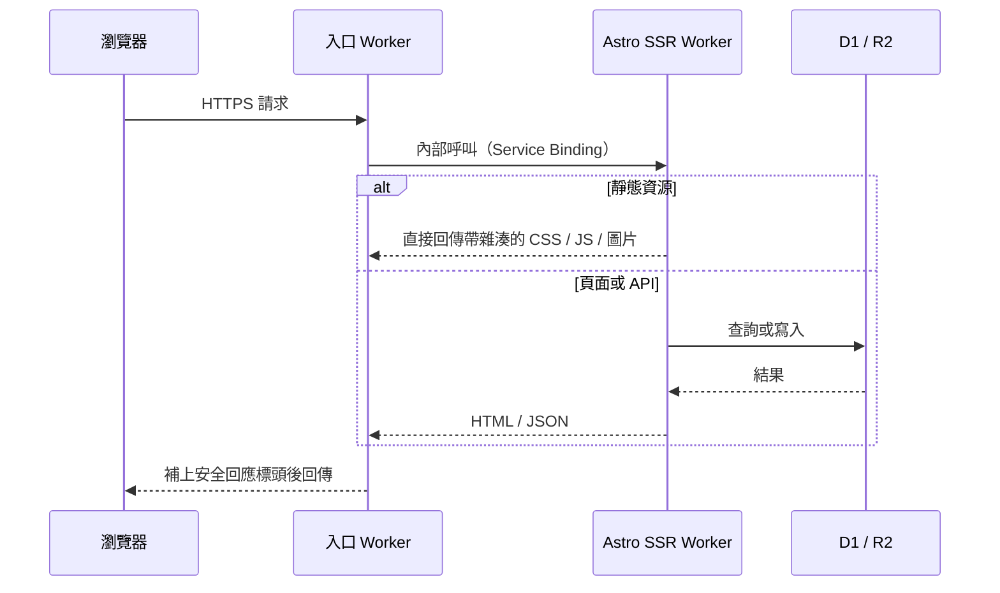

---
title: 基於 Cloudflare 構建個人網站
description: 兩個 Worker、一個 SQL 資料庫、一個物件儲存。這個站的完整結構，以及它為什麼能做到除網域外接近零成本。
createdAt: 2026-08-13T00:00:00.000Z
updatedAt: 2026-08-13T00:00:00.000Z
published: true
tags:
  - 網路
  - 建站
  - 最佳化
slug: 20260813-02
---

你現在看到的這個站，表面上是個部落格，實際上跑著兩個 Cloudflare Worker、一個 SQL 資料庫和一個物件儲存。留言、按讚、瀏覽量是即時的，書影音收藏有自己的管理後台，聽歌排行每天凌晨自動同步。而帳單裡除了網域，其他部分約等於零。

這篇文章介紹它的結構：請求從哪進來、資料放在哪、圖片怎麼處理、中國大陸訪問為什麼不算慢。不是搭建教學，更像一張導覽圖。如果你也想用 Cloudflare 搭站，文末我會說哪些部分值得抄、哪些不值得。

## 全景

各部分的分工一句話就能說完。入口 Worker 負責接住公開網域的所有流量；Astro SSR Worker 是真正的應用，渲染頁面、處理 API；D1 存所有結構化資料；R2 存所有圖片；Access 把 `/admin/` 後台擋在 Cloudflare 邊緣；Cron 每天觸發一次資料同步。

整個站沒有傳統意義上的伺服器。沒有固定 IP，沒有要打修補程式的系統，沒有半夜掛掉需要重啟的行程。

## 一次請求發生了什麼

這裡有一個對成本影響最大的細節：命中靜態資源的請求不執行程式碼，也不計入 Workers 的請求額度。CSS、JS、字型、本地圖片都屬於這類，它們免費且不限量。真正消耗每天 10 萬次免費額度的，只有需要跑程式碼的 HTML 渲染和 API 呼叫。

所以我的原則是讓盡可能多的請求停在靜態層。只有 `/api/*`、`/admin/*` 這類必須動態處理的路徑才設定成「先過 Worker」。

## 為什麼是兩個 Worker

入口 Worker 非常薄，加起來不到一百行：校驗請求的 Host 是不是我的網域，拒絕明顯的跨站寫入請求，轉發給應用 Worker，最後統一補上 HSTS 之類的安全回應標頭。

它存在的意義不是效能，是解耦。我的公開網域走了中國大陸優選入口（後面會講），這條鏈路以後可能會換方案；應用 Worker 則幾乎每天都在部署。兩邊拆開之後，改任何一邊都不用碰另一邊。轉發用的是 Service Binding，也就是 Worker 之間的內部呼叫，不經過公開 URL，不額外收費，應用 Worker 也因此不需要暴露任何可以被繞過入口直接訪問的位址。

如果你的站不需要折騰入口鏈路，這一層完全可以省掉。

## 資料放在哪

D1 是 Cloudflare 的託管 SQLite，存著這個站所有的結構化資料：留言、按讚、瀏覽量、書影音收藏的中繼資料、遊戲紀錄、聽歌排行。

用 D1 之前我沒關注過一個指標：列讀取量。D1 免費額度每天 500 萬列，但按的是掃描列數，不是回傳列數。一個回傳 20 條留言的查詢，如果沒走索引掃了全表，計的可能是幾萬列。給常用過濾欄位建索引、清單分頁，這些老生常談的最佳化在 D1 上直接關係到額度還剩多少。

R2 存所有圖片：內文插圖、收藏封面。選它的決定性原因是出口流量免費，圖床最怕的就是流量費。R2 只存檔案，檔案的來源、歸屬這些中繼資料在 D1 裡，兩邊透過物件鍵關聯。

Cron 每天北京時間凌晨四點觸發一次：先給網易雲的登入 Cookie 續期，再抓一週排行和總排行寫進 D1。哪一步失敗就保留上次的成功結果，音樂頁不會因為一次同步失敗而空白。

## 圖片管線

我在 Obsidian 裡寫文章，貼上圖片的瞬間，圖床外掛把它直接傳到 R2，Markdown 裡留下的是一個線上 URL。倉庫裡從頭到尾沒有圖片二進位檔案，git 歷史不會膨脹。

構建的時候，指令碼會為每張首次出現的圖產生 AVIF 和 WebP 的多個寬度版本（640 / 1280 / 1920），傳回 R2 同目錄，並把映射寫進 manifest。渲染時 Markdown 裡那個 URL 不變，輸出的 HTML 卻是完整的 `<picture>`：瀏覽器按視口和像素密度挑最小夠用的檔案，內文第一張圖高優先度載入，其餘的延遲載入。原圖 URL 永遠有效，作為兜底。

一個哭笑不得的細節：AVIF 檔案在 R2 裡的儲存鍵是 `.avif.webp`，回傳的 MIME 還是 `image/avif`。因為圖床網域的某處會錯誤攔截 `.avif` 副檔名，與其排查那條鏈路，不如改個副檔名繞過去。

## 免費額度的真實邊界

「零成本」需要加限定：除網域外、訪問量和資料量在免費額度內時，帳單約等於零。額度具體是（2026 年 7 月查詢的官方數字）：

| 項目 | 免費額度 | 我的用法 |
| --- | --- | --- |
| Workers 動態請求 | 10 萬次/天，帳戶共享 | 靜態資源不占，只有 SSR 和 API 消耗 |
| 靜態資源請求 | 免費，不限量 | 大部分請求停在這層 |
| D1 | 500 萬列讀/天，10 萬列寫/天 | 索引 + 分頁，避免全表掃描 |
| R2 | 10 GB 儲存，出口流量免費 | 圖床和封面庫，遠用不滿 |

兩個容易誤解的地方：10 萬次是整個帳戶每天的免費上限，不是每個 Worker 各 10 萬；D1 按掃描列計數，無索引查詢會以你想不到的速度吃掉額度。

我的策略壓縮成一句話：靜態的不進指令碼，進指令碼的少掃列，圖片在構建時處理完。

## 中國大陸訪問

Cloudflare 的預設入口是 Anycast，路由由 BGP 決定，對中國大陸三大電信商不總是友好。同一個站，電信可能很快，移動晚高峰可能繞路丟包。

我的做法是優選 CNAME：把網域 CNAME 到一個會持續測速、更新解析結果的目標網域。要說清楚它是什麼：它只改善「瀏覽器連到 Cloudflare 哪個入口」這第一段路徑，TLS 憑證還是我自己的，Host 還是我的網域，內容不經過任何第三方解密。它不是中國大陸 CDN，不是備案節點，也不保證所有地區所有時段都更快。第三方服務隨時可能失效，所以我保留著一分鐘內改回預設 DNS 的回退方案。

進站之後的速度靠快取分層，規則按「內容多久會變」來定：

- 帶內容雜湊的 CSS / JS / 字型：快取一年，`immutable`。檔案變了 URL 就變，永遠不會讀到舊檔案。
- HTML：`no-cache`，可以存但每次要重新驗證，保證部署後不會拿著舊頁面引用已經消失的資源。
- 留言、統計這類動態 API：邊緣快取 15 秒，寫入請求一律 `no-store`。
- GitHub 熱力圖快取 6 小時，WakaTime 快取 15 分鐘。TTL 跟著資料的實際變化頻率走。

最後是感知層面的。首頁是五個橫向頁面的 SPA：當前頁直出，相鄰頁在瀏覽器空閒時預取，滑鼠懸停到某個導覽時立即預取對應頁面。首次載入的遮罩只等兩件事：頁面完成兩幀繪製、首屏第一張圖解碼完成，不等 `window.load`，因為後者會被延遲載入圖片和統計請求拖住。

## 哪些值得抄

如果你的站是純靜態部落格，Astro 加靜態資源託管就夠了，一個 Worker 都不需要。架構應該跟著需求長，而不是跟著文章長。

如果你需要留言、後台、定時任務，D1 加 SSR Worker 是我用過的個人專案裡維護成本最低的組合。記得看列讀取量。

如果中國大陸訪問速度困擾你，先花一個晚上分電信商實測，再決定要不要上優選。無論上不上，都把回退路徑留好。

## 參考

- [Workers 平台限制](https://developers.cloudflare.com/workers/platform/limits/)
- [靜態資源計費規則](https://developers.cloudflare.com/workers/static-assets/billing-and-limitations/)
- [Service Bindings](https://developers.cloudflare.com/workers/runtime-apis/bindings/service-bindings/)
- [D1 定價](https://developers.cloudflare.com/d1/platform/pricing/)
- [R2 定價](https://developers.cloudflare.com/r2/pricing/)
- [MDN：Cache-Control](https://developer.mozilla.org/docs/Web/HTTP/Reference/Headers/Cache-Control)