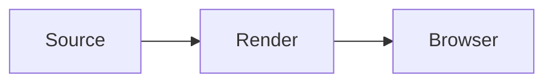

# Markdown Showcase

This paragraph has **bold text**, *italic text*, ~~deleted text~~, a [link](https://example.com), and `inline code`.

## Lists and quotes

- Unordered item
- [x] Completed task
- [ ] Open task

1. First item
2. Second item

> A blockquote with useful context.

### Table and image

| Feature | Status |
| --- | --- |
| Markdown | Ready |


---

#### Code examples

```js
const greeting = "hello";
console.log(greeting);
```

```python
def greet(name):
    return f"Hello, {name}"
```

```bash
printf '%s\n' "hello"
```

Inline math uses $E = mc^2$.

$$
\int_0^1 x^2\,dx = \frac{1}{3}
$$

:::note{#directive-note .callout data-kind=info}
Directive **content** stays renderable.
:::

Before :badge[New]{data-kind=info} after.


